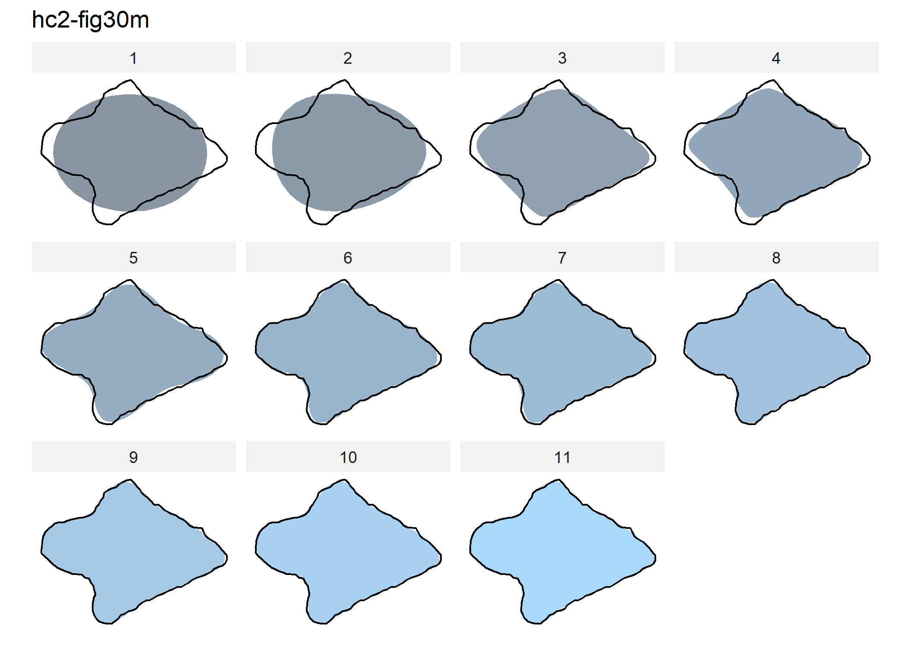
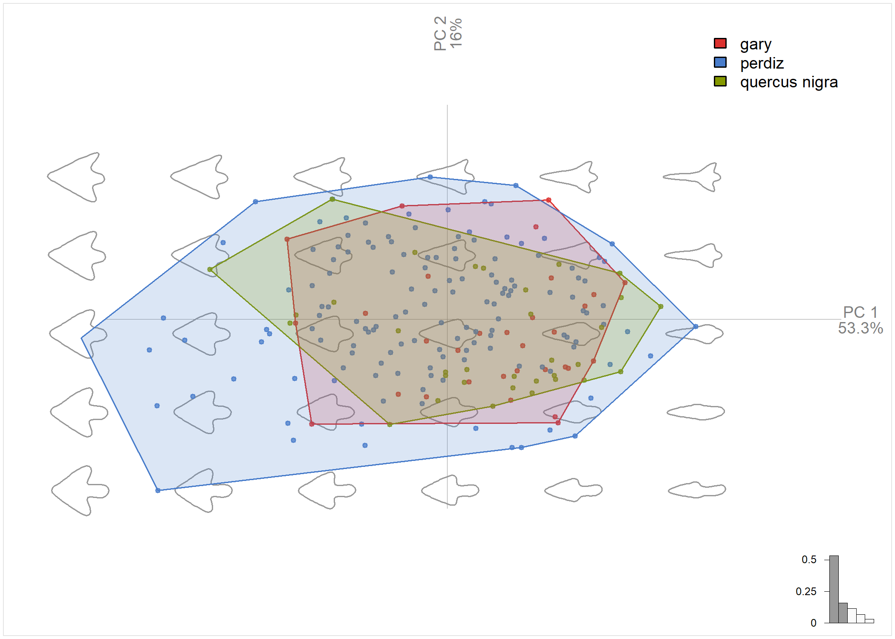

A potential biological correlate of *design intent* for Gary dart points
from the American Southeast: A case study from the Poverty Point World
Heritage Site
================
Robert Z. Selden, Jr.
29 September, 2021

## Load packages + data

``` r
# install required analysis packages
#devtools::install_github("r-lib/here")
#devtools::install_github("karthik/wesanderson")
#devtools::install_github("MomX/Momocs")

# load packages
library(here)
```

    ## here() starts at E:/github/quercus

``` r
library(wesanderson)
library(Momocs)
```

    ## 
    ## Attaching package: 'Momocs'

    ## The following object is masked from 'package:stats':
    ## 
    ##     filter

``` r
# read images
jpg.list <- list.files(here("./jpeg"), 
                       full.names = TRUE)

# read attribute data
att.data <- read.csv("att.data.csv", 
                     header = TRUE, 
                     as.is = TRUE)

# attribute to factor
att.data$type <- as.factor(att.data$type)
```

## Generate outlines

    ## Extracting 206.jpg outlines...

    ## [ 1 / 206 ]  16wc5_dawson-10.jpg
    ## [ 2 / 206 ]  16wc5_dawson-11.jpg
    ## [ 3 / 206 ]  16wc5_dawson-12.jpg
    ## [ 4 / 206 ]  16wc5_dawson-13.jpg
    ## [ 5 / 206 ]  16wc5_dawson-14.jpg
    ## [ 6 / 206 ]  16wc5_dawson-15.jpg
    ## [ 7 / 206 ]  16wc5_dawson-17.jpg
    ## [ 8 / 206 ]  16wc5_dawson-19.jpg
    ## [ 9 / 206 ]  16wc5_dawson-20.jpg
    ## [ 10 / 206 ]  16wc5_dawson-21.jpg
    ## [ 11 / 206 ]  16wc5_dawson-23.jpg
    ## [ 12 / 206 ]  16wc5_dawson-24.jpg
    ## [ 13 / 206 ]  16wc5_dawson-27.jpg
    ## [ 14 / 206 ]  16wc5_dawson-28.jpg
    ## [ 15 / 206 ]  16wc5_dawson-29.jpg
    ## [ 16 / 206 ]  16wc5_dawson-30.jpg
    ## [ 17 / 206 ]  16wc5_dawson-31.jpg
    ## [ 18 / 206 ]  16wc5_dawson-32.jpg
    ## [ 19 / 206 ]  16wc5_dawson-34.jpg
    ## [ 20 / 206 ]  16wc5_dawson-35.jpg
    ## [ 21 / 206 ]  16wc5_dawson-36.jpg
    ## [ 22 / 206 ]  16wc5_dawson-37.jpg
    ## [ 23 / 206 ]  16wc5_dawson-39.jpg
    ## [ 24 / 206 ]  16wc5_dawson-40.jpg
    ## [ 25 / 206 ]  16wc5_DS_35.jpg
    ## [ 26 / 206 ]  16wc5_plunkett.1.jpg
    ## [ 27 / 206 ]  16wc5_plunkett.2.jpg
    ## [ 28 / 206 ]  16wc5_proj.1.15.site1.jpg
    ## [ 29 / 206 ]  16wc5_proj.1.15.site2.jpg
    ## [ 30 / 206 ]  16wc5_qhg.jpg
    ## [ 31 / 206 ]  489.jpg
    ## [ 32 / 206 ]  490.jpg
    ## [ 33 / 206 ]  553.jpg
    ## [ 34 / 206 ]  554.jpg
    ## [ 35 / 206 ]  555.jpg
    ## [ 36 / 206 ]  556.jpg
    ## [ 37 / 206 ]  558.jpg
    ## [ 38 / 206 ]  559.jpg
    ## [ 39 / 206 ]  562.jpg
    ## [ 40 / 206 ]  565.jpg
    ## [ 41 / 206 ]  591.jpg
    ## [ 42 / 206 ]  598.jpg
    ## [ 43 / 206 ]  645.jpg
    ## [ 44 / 206 ]  646.jpg
    ## [ 45 / 206 ]  647.jpg
    ## [ 46 / 206 ]  648.jpg
    ## [ 47 / 206 ]  649.jpg
    ## [ 48 / 206 ]  650.jpg
    ## [ 49 / 206 ]  651.jpg
    ## [ 50 / 206 ]  652.jpg
    ## [ 51 / 206 ]  653.jpg
    ## [ 52 / 206 ]  654.jpg
    ## [ 53 / 206 ]  655.jpg
    ## [ 54 / 206 ]  656.jpg
    ## [ 55 / 206 ]  657.jpg
    ## [ 56 / 206 ]  658.jpg
    ## [ 57 / 206 ]  659.jpg
    ## [ 58 / 206 ]  660.jpg
    ## [ 59 / 206 ]  661.jpg
    ## [ 60 / 206 ]  665.jpg
    ## [ 61 / 206 ]  677.jpg
    ## [ 62 / 206 ]  678.jpg
    ## [ 63 / 206 ]  an115-fig7.jpg
    ## [ 64 / 206 ]  an51-fig26a.jpg
    ## [ 65 / 206 ]  an51-fig26c.jpg
    ## [ 66 / 206 ]  chapman.jpg
    ## [ 67 / 206 ]  cp220-fig11-12a.jpg
    ## [ 68 / 206 ]  cp495-fig16h.jpg
    ## [ 69 / 206 ]  cp495-fig16i.jpg
    ## [ 70 / 206 ]  hc2-fig30a.jpg
    ## [ 71 / 206 ]  hc2-fig30b.jpg
    ## [ 72 / 206 ]  hc2-fig30c.jpg
    ## [ 73 / 206 ]  hc2-fig30d.jpg
    ## [ 74 / 206 ]  hc2-fig30f.jpg
    ## [ 75 / 206 ]  hc2-fig30h.jpg
    ## [ 76 / 206 ]  hc2-fig30i.jpg
    ## [ 77 / 206 ]  hc2-fig30l.jpg
    ## [ 78 / 206 ]  hc2-fig30m.jpg
    ## [ 79 / 206 ]  hc2-fig30n.jpg
    ## [ 80 / 206 ]  hs15-fig7.1r.jpg
    ## [ 81 / 206 ]  hs15-fig7.1t.jpg
    ## [ 82 / 206 ]  hs15-fig7.1u.jpg
    ## [ 83 / 206 ]  hs15-fig7.1v.jpg
    ## [ 84 / 206 ]  hs15-fig7.1w.jpg
    ## [ 85 / 206 ]  hs15-fig7.1x.jpg
    ## [ 86 / 206 ]  hs15-fig7.2b.jpg
    ## [ 87 / 206 ]  hs15-fig7.2c.jpg
    ## [ 88 / 206 ]  hs15-fig7.2d.jpg
    ## [ 89 / 206 ]  hs15-fig7.2e.jpg
    ## [ 90 / 206 ]  hs15-fig7.2f.jpg
    ## [ 91 / 206 ]  hs15-fig7.2g.jpg
    ## [ 92 / 206 ]  hs15-fig7.2m.jpg
    ## [ 93 / 206 ]  hs15-fig7.2o.jpg
    ## [ 94 / 206 ]  hs15-fig7.2q.jpg
    ## [ 95 / 206 ]  hs15-fig7.2r.jpg
    ## [ 96 / 206 ]  hs15-fig7.3a.jpg
    ## [ 97 / 206 ]  hs15-fig7.3aa.jpg
    ## [ 98 / 206 ]  hs15-fig7.3b.jpg
    ## [ 99 / 206 ]  hs15-fig7.3bb.jpg
    ## [ 100 / 206 ]  hs15-fig7.3cc.jpg
    ## [ 101 / 206 ]  hs15-fig7.3d.jpg
    ## [ 102 / 206 ]  hs15-fig7.3e.jpg
    ## [ 103 / 206 ]  hs15-fig7.3f.jpg
    ## [ 104 / 206 ]  hs15-fig7.3g.jpg
    ## [ 105 / 206 ]  hs15-fig7.3h.jpg
    ## [ 106 / 206 ]  hs15-fig7.3i.jpg
    ## [ 107 / 206 ]  hs15-fig7.3j.jpg
    ## [ 108 / 206 ]  hs15-fig7.3k.jpg
    ## [ 109 / 206 ]  hs15-fig7.3l.jpg
    ## [ 110 / 206 ]  hs15-fig7.3m.jpg
    ## [ 111 / 206 ]  hs15-fig7.3n.jpg
    ## [ 112 / 206 ]  hs15-fig7.3o.jpg
    ## [ 113 / 206 ]  hs15-fig7.3p.jpg
    ## [ 114 / 206 ]  hs15-fig7.3q.jpg
    ## [ 115 / 206 ]  hs15-fig7.3r.jpg
    ## [ 116 / 206 ]  hs15-fig7.3s.jpg
    ## [ 117 / 206 ]  hs15-fig7.3t.jpg
    ## [ 118 / 206 ]  hs15-fig7.3u.jpg
    ## [ 119 / 206 ]  hs15-fig7.3w.jpg
    ## [ 120 / 206 ]  hs15-fig7.3x.jpg
    ## [ 121 / 206 ]  hs15-fig7.3y.jpg
    ## [ 122 / 206 ]  hs15-fig7.3z.jpg
    ## [ 123 / 206 ]  hs235-fig17.jpg
    ## [ 124 / 206 ]  hs269-fig12j.jpg
    ## [ 125 / 206 ]  na206-fig12a.jpg
    ## [ 126 / 206 ]  na206-fig12b.jpg
    ## [ 127 / 206 ]  na206-fig12d.jpg
    ## [ 128 / 206 ]  na206-fig12f.jpg
    ## [ 129 / 206 ]  na206-fig12g.jpg
    ## [ 130 / 206 ]  na49-1.jpg
    ## [ 131 / 206 ]  na49-10.jpg
    ## [ 132 / 206 ]  na49-11.jpg
    ## [ 133 / 206 ]  na49-12.jpg
    ## [ 134 / 206 ]  na49-13.jpg
    ## [ 135 / 206 ]  na49-137.jpg
    ## [ 136 / 206 ]  na49-14.jpg
    ## [ 137 / 206 ]  na49-149.jpg
    ## [ 138 / 206 ]  na49-176.jpg
    ## [ 139 / 206 ]  na49-187.jpg
    ## [ 140 / 206 ]  na49-195.jpg
    ## [ 141 / 206 ]  na49-2.jpg
    ## [ 142 / 206 ]  na49-271.jpg
    ## [ 143 / 206 ]  na49-3.jpg
    ## [ 144 / 206 ]  na49-33.jpg
    ## [ 145 / 206 ]  na49-4.jpg
    ## [ 146 / 206 ]  na49-5.jpg
    ## [ 147 / 206 ]  na49-587.jpg
    ## [ 148 / 206 ]  na49-616.jpg
    ## [ 149 / 206 ]  na49-7.jpg
    ## [ 150 / 206 ]  na49-734.jpg
    ## [ 151 / 206 ]  na49-8.jpg
    ## [ 152 / 206 ]  na49-9.jpg
    ## [ 153 / 206 ]  quercus1.jpg
    ## [ 154 / 206 ]  quercus10.jpg
    ## [ 155 / 206 ]  quercus11.jpg
    ## [ 156 / 206 ]  quercus12.jpg
    ## [ 157 / 206 ]  quercus13.jpg
    ## [ 158 / 206 ]  quercus14.jpg
    ## [ 159 / 206 ]  quercus15.jpg
    ## [ 160 / 206 ]  quercus16.jpg
    ## [ 161 / 206 ]  quercus17.jpg
    ## [ 162 / 206 ]  quercus18.jpg
    ## [ 163 / 206 ]  quercus19.jpg
    ## [ 164 / 206 ]  quercus2.jpg
    ## [ 165 / 206 ]  quercus20.jpg
    ## [ 166 / 206 ]  quercus21.jpg
    ## [ 167 / 206 ]  quercus22.jpg
    ## [ 168 / 206 ]  quercus23.jpg
    ## [ 169 / 206 ]  quercus24.jpg
    ## [ 170 / 206 ]  quercus25.jpg
    ## [ 171 / 206 ]  quercus26.jpg
    ## [ 172 / 206 ]  quercus27.jpg
    ## [ 173 / 206 ]  quercus28.jpg
    ## [ 174 / 206 ]  quercus29.jpg
    ## [ 175 / 206 ]  quercus3.jpg
    ## [ 176 / 206 ]  quercus30.jpg
    ## [ 177 / 206 ]  quercus31.jpg
    ## [ 178 / 206 ]  quercus32.jpg
    ## [ 179 / 206 ]  quercus33.jpg
    ## [ 180 / 206 ]  quercus4.jpg
    ## [ 181 / 206 ]  quercus5.jpg
    ## [ 182 / 206 ]  quercus6.jpg
    ## [ 183 / 206 ]  quercus7.jpg
    ## [ 184 / 206 ]  quercus8.jpg
    ## [ 185 / 206 ]  quercus9.jpg
    ## [ 186 / 206 ]  sa135-fig15b.jpg
    ## [ 187 / 206 ]  sa135-fig15c.jpg
    ## [ 188 / 206 ]  sa135-fig15g.jpg
    ## [ 189 / 206 ]  sm193-fig1e.jpg
    ## [ 190 / 206 ]  sm193-fig2a.jpg
    ## [ 191 / 206 ]  sm193-fig2b.jpg
    ## [ 192 / 206 ]  sm193-fig2e.jpg
    ## [ 193 / 206 ]  sm193-fig2f.jpg
    ## [ 194 / 206 ]  sm193-fig2g.jpg
    ## [ 195 / 206 ]  sm195-fig8.jpg
    ## [ 196 / 206 ]  sm442-fig19c.jpg
    ## [ 197 / 206 ]  sm55-fig23.jpg
    ## [ 198 / 206 ]  sy280-1.jpg
    ## [ 199 / 206 ]  sy280-2.jpg
    ## [ 200 / 206 ]  sy280-3.jpg
    ## [ 201 / 206 ]  sy43-1.jpg
    ## [ 202 / 206 ]  sy43-2.jpg
    ## [ 203 / 206 ]  sy43-3.jpg
    ## [ 204 / 206 ]  sy43-4.jpg
    ## [ 205 / 206 ]  sy43-5.jpg
    ## [ 206 / 206 ]  sy43-6.jpg

    ## Done in 1.3 mins

## Calibrate harmonic + EFA

``` r
# calibrate how many harmonics needed
calibrate_harmonicpower_efourier(norm.outlines, 
                                 nb.h = 30)
```

    ## $gg


    ## 
    ## $q
    ##                              h1       h2       h3       h4       h5       h6
    ## 16wc5_dawson-10       11.279084 85.58288 85.81258 94.86191 96.04479 98.60862
    ## 16wc5_dawson-11        1.516165 72.35186 76.98980 91.58046 95.16528 95.69619
    ## 16wc5_dawson-12       16.245137 73.21327 74.69902 89.93632 94.09435 96.33994
    ## 16wc5_dawson-13       33.414512 88.42698 89.45391 95.52538 96.94976 98.51404
    ## 16wc5_dawson-14       13.953406 81.09233 82.85529 94.80316 95.94646 98.43386
    ## 16wc5_dawson-15       21.478953 81.80050 84.54407 94.59767 97.06240 97.67444
    ## 16wc5_dawson-17       11.882373 79.90380 82.09211 94.21884 95.78597 97.99868
    ## 16wc5_dawson-19       24.254830 88.65581 89.38247 96.01714 96.37328 97.52721
    ## 16wc5_dawson-20        2.512718 76.43942 78.67606 93.27142 94.69717 98.12258
    ## 16wc5_dawson-21        3.928950 78.62228 81.54719 94.55747 95.53422 96.63705
    ## 16wc5_dawson-23       16.207119 86.22188 86.76958 95.86280 95.96438 98.24657
    ## 16wc5_dawson-24       14.696415 83.00821 84.27595 94.88001 96.69844 97.65965
    ## 16wc5_dawson-27       23.104233 77.79945 81.89732 94.83145 96.48550 97.82337
    ## 16wc5_dawson-28       15.573569 85.98265 86.94473 95.52685 96.63416 98.46165
    ## 16wc5_dawson-29       24.590951 82.03034 84.92901 95.55329 97.08582 97.47338
    ## 16wc5_dawson-30        5.197316 75.26683 75.37252 91.62528 96.84646 97.41100
    ## 16wc5_dawson-31        7.535763 67.48337 70.42541 87.63254 90.57267 97.62515
    ## 16wc5_dawson-32       16.802596 80.32280 85.10867 94.02695 96.38898 97.84359
    ## 16wc5_dawson-34       16.996097 62.61176 69.56715 87.02220 90.02600 94.99221
    ## 16wc5_dawson-35       11.527445 70.11169 70.97812 86.79941 94.76626 95.40055
    ## 16wc5_dawson-36        3.456741 73.86023 82.75309 93.76607 95.98448 97.49696
    ## 16wc5_dawson-37       33.607771 75.16113 80.78010 92.24748 94.16761 98.01807
    ## 16wc5_dawson-39        9.318356 72.43565 76.76405 91.01806 92.00059 97.43792
    ## 16wc5_dawson-40       24.179887 68.14096 73.66411 88.75496 90.78914 96.19126
    ## 16wc5_DS_35           18.451548 86.50935 87.55819 95.52015 95.96878 98.47181
    ## 16wc5_plunkett.1      28.677517 78.27466 81.65317 91.78210 92.61039 97.49453
    ## 16wc5_plunkett.2      44.837386 73.32804 82.20937 92.29378 93.18138 97.24222
    ## 16wc5_proj.1.15.site1 27.071238 73.72851 78.65026 90.15917 90.65416 96.32737
    ## 16wc5_proj.1.15.site2 16.359962 77.01157 78.66503 89.80469 92.53714 97.67278
    ## 16wc5_qhg              9.830632 71.16723 75.51455 89.35444 91.66912 97.58151
    ## 489                   72.808791 83.78198 95.17554 95.58620 96.94914 97.61501
    ## 490                   64.114719 71.74229 80.72420 89.12673 91.89527 97.25527
    ## 553                   60.227643 67.66112 78.47978 88.42469 91.97133 97.96056
    ## 554                   40.784025 62.70509 71.02441 88.80778 92.02025 97.18926
    ## 555                   71.883368 75.67063 83.98654 89.34967 91.27061 96.88514
    ## 556                   40.131674 62.71068 66.15981 84.78732 88.45546 94.74772
    ## 558                   63.012149 77.73567 90.06870 90.36598 91.90045 93.94937
    ## 559                   37.440231 60.66242 71.29934 86.72881 90.17083 96.07668
    ## 562                   60.694645 69.96634 77.12798 87.14123 90.12571 96.20471
    ## 565                   64.493270 80.33025 89.87705 90.69617 92.26710 94.75796
    ## 591                   32.410597 64.36665 71.82945 90.72323 94.12426 97.00883
    ## 598                   54.095190 69.79342 80.21895 91.62848 93.17747 97.30424
    ## 645                   37.430706 61.77266 70.12401 88.30539 92.41149 97.17813
    ## 646                   48.472059 67.04623 73.39793 90.58139 94.34818 96.89540
    ## 647                   63.962317 66.40189 73.20076 87.28925 92.34106 97.84810
    ## 648                   51.661887 60.75373 67.73491 84.11689 90.80362 96.67577
    ## 649                   13.198214 67.02359 73.20792 91.32686 96.27920 97.08839
    ## 650                   62.500557 67.69024 73.36673 89.73518 94.63252 98.08290
    ## 651                   25.861992 55.85938 68.03343 87.64255 92.73702 96.70377
    ## 652                   22.576477 60.60679 68.19757 89.37573 93.98487 96.56320
    ## 653                   53.506327 62.33004 70.77582 88.94387 93.68013 97.88528
    ## 654                   44.031205 66.31590 73.29146 91.93527 95.20683 97.46861
    ## 655                   53.169643 60.43443 64.83868 83.34328 89.55824 96.76372
    ## 656                   57.110466 63.11221 68.16400 82.60450 87.07412 95.61119
    ## 657                   44.153580 55.01196 61.02296 82.80466 87.94802 95.93126
    ## 658                   61.749011 65.60642 71.58815 87.75926 93.23432 98.24621
    ## 659                   50.938090 63.91895 68.76493 86.94809 89.69221 95.89946
    ## 660                   44.673501 62.32531 67.80680 90.92520 94.83023 96.73639
    ## 661                   48.318800 59.00113 64.26505 85.67911 90.52577 96.55592
    ## 665                   72.904144 75.33543 80.78979 88.20015 91.08371 97.41274
    ## 677                   43.622937 58.91874 66.48334 89.42983 93.54165 96.83488
    ## 678                   70.247711 71.42578 81.10140 86.84716 90.52952 96.31749
    ## an115-fig7            52.227029 66.03736 74.39393 88.54440 91.97779 97.28538
    ## an51-fig26a           20.037123 58.27095 69.00891 87.33896 90.87947 95.25013
    ## an51-fig26c            5.569516 66.06432 67.78975 83.78661 93.79860 95.42376
    ## chapman               11.145536 70.51189 74.69770 92.39441 95.42976 97.40419
    ## cp220-fig11-12a       24.270853 66.78380 75.72064 89.09655 94.60917 97.86886
    ## cp495-fig16h          21.828872 76.92704 77.45953 89.30653 92.79550 96.99783
    ## cp495-fig16i          32.290335 69.65830 76.51722 87.51585 92.09235 97.25701
    ## hc2-fig30a            31.443969 64.91809 72.27750 87.85379 92.19407 96.52837
    ## hc2-fig30b            24.368604 65.44627 75.95778 91.12530 95.69031 97.25935
    ## hc2-fig30c            25.021648 54.55200 73.16338 86.41281 93.97584 96.50676
    ## hc2-fig30d            32.600307 70.85041 80.81362 90.21947 92.87453 97.36015
    ## hc2-fig30f            25.281135 56.66617 66.15792 86.45458 92.05083 95.48998
    ## hc2-fig30h            41.608328 66.76010 75.16286 89.86967 91.15889 96.52898
    ## hc2-fig30i            24.324680 68.58600 80.68794 93.93977 98.25380 98.40543
    ## hc2-fig30l            41.799724 73.17804 77.87763 88.64031 92.31580 97.11762
    ## hc2-fig30m            14.074264 69.64550 75.02785 92.50994 97.31574 97.51295
    ## hc2-fig30n            21.358855 68.80878 77.57564 96.17833 96.95828 97.75673
    ## hs15-fig7.1r          55.819696 71.01458 82.22449 93.28097 95.42506 98.12675
    ## hs15-fig7.1t          11.961633 61.26533 63.25710 82.65330 89.87322 94.63257
    ## hs15-fig7.1u          14.337987 65.35692 73.53334 92.95711 96.22778 96.82878
    ## hs15-fig7.1v           3.492256 71.63388 75.33408 92.33748 95.19502 95.68231
    ## hs15-fig7.1w          46.639077 66.92716 71.95296 89.48486 93.55210 97.14504
    ## hs15-fig7.1x          46.019946 60.04771 68.99336 87.24467 91.43684 96.39134
    ## hs15-fig7.2b          41.537124 61.83979 68.50133 88.05123 92.86222 96.73671
    ## hs15-fig7.2c          26.210872 64.89798 72.92422 90.99264 94.35831 97.87073
    ## hs15-fig7.2d          50.843985 63.21557 68.66386 91.27511 95.19385 97.36590
    ## hs15-fig7.2e          36.739826 63.50892 72.56451 91.64052 95.27037 97.42852
    ## hs15-fig7.2f          38.091666 53.88734 63.44261 85.55478 90.89651 95.83630
    ## hs15-fig7.2g          13.353906 65.17654 72.59573 91.88886 95.38385 96.25522
    ## hs15-fig7.2m          39.662894 62.79807 77.38253 95.18865 96.28126 97.14239
    ## hs15-fig7.2o          45.828395 62.07647 71.40430 93.93353 96.45347 97.04749
    ## hs15-fig7.2q          49.272394 63.76300 72.50353 93.88312 96.66015 97.40158
    ## hs15-fig7.2r          37.645248 62.34001 71.06586 91.77327 95.62264 96.77956
    ## hs15-fig7.3a           6.591274 67.86797 72.20289 90.78355 95.22879 95.48230
    ## hs15-fig7.3aa         47.625663 66.53040 70.73643 89.11044 92.71088 97.12734
    ## hs15-fig7.3b          18.570415 67.25161 71.32412 88.64994 92.17994 96.17440
    ## hs15-fig7.3bb         19.270594 62.83549 71.09261 89.73132 95.00728 96.30606
    ## hs15-fig7.3cc         22.874585 66.59133 76.59202 93.68998 96.32073 97.60104
    ## hs15-fig7.3d          11.076212 72.04341 77.91163 91.50163 94.41508 95.25557
    ## hs15-fig7.3e          16.397683 65.37038 69.87954 88.50356 94.60142 96.25158
    ## hs15-fig7.3f          30.276454 65.29473 71.80241 90.06702 94.05178 96.39283
    ## hs15-fig7.3g          23.894780 58.61507 66.14329 89.40797 93.28609 96.37736
    ## hs15-fig7.3h          21.057798 68.75930 79.15366 93.54747 96.43109 97.11473
    ## hs15-fig7.3i          27.462788 56.10201 64.21575 90.24945 93.90238 95.50411
    ## hs15-fig7.3j          21.348830 64.47995 70.07761 89.15985 92.55359 95.70938
    ## hs15-fig7.3k          27.552468 65.83402 72.31348 90.75328 95.42253 96.58027
    ## hs15-fig7.3l          21.440250 60.51949 66.30950 89.43242 93.47248 95.90957
    ## hs15-fig7.3m          13.119703 58.91781 65.09925 87.61667 90.91060 94.88178
    ## hs15-fig7.3n          23.565703 66.86787 73.12740 90.74725 93.95903 96.23464
    ## hs15-fig7.3o          34.173472 64.11802 68.42885 89.48982 93.02418 96.21821
    ## hs15-fig7.3p          28.416763 56.92704 64.83637 90.29089 93.94560 95.60584
    ## hs15-fig7.3q           8.730310 69.08153 74.80313 91.73953 97.13911 97.32774
    ## hs15-fig7.3r          32.505703 58.59358 68.18273 88.52792 91.18938 95.97676
    ## hs15-fig7.3s          62.792307 68.90132 72.39010 89.24210 93.46037 97.75214
    ## hs15-fig7.3t          11.695277 65.59783 72.69486 90.70011 95.82473 96.19047
    ## hs15-fig7.3u          23.135711 63.82916 68.28633 87.18427 89.33959 95.10053
    ## hs15-fig7.3w          16.056141 62.40911 70.59414 88.68918 93.77281 95.71197
    ## hs15-fig7.3x          18.605514 64.04033 68.79147 89.19816 94.88594 96.35301
    ## hs15-fig7.3y          29.720414 64.92382 72.05845 91.05246 94.53925 95.93626
    ## hs15-fig7.3z          45.211811 63.66315 74.29130 92.19532 95.94944 97.37009
    ## hs235-fig17           60.405492 62.04988 65.44217 82.49696 87.21434 96.04083
    ## hs269-fig12j          63.971683 67.68150 75.40548 86.08323 90.80192 97.45045
    ## na206-fig12a          29.315612 66.84137 76.66761 93.51982 97.39890 97.62347
    ## na206-fig12b          44.631629 64.97371 74.31584 90.83431 95.02177 98.06848
    ## na206-fig12d          36.475137 62.54248 72.49305 95.07289 97.03934 97.60288
    ## na206-fig12f          25.067330 63.76778 76.20362 94.27157 97.39378 97.85715
    ## na206-fig12g          34.082458 70.44068 82.64302 94.72626 97.47478 97.87736
    ## na49-1                31.921654 75.75622 77.75438 85.53597 87.68155 93.51100
    ## na49-10               32.008246 69.77940 74.86502 86.55727 93.28558 96.86398
    ## na49-11               42.199996 71.86912 76.35051 88.47760 90.84893 96.66611
    ## na49-12               55.712313 71.83206 74.09161 84.99478 87.04896 93.82331
    ## na49-13               48.817416 71.35210 75.64633 89.22010 90.63990 95.87327
    ## na49-137              59.917382 70.02518 74.67464 88.09115 90.84073 95.48831
    ## na49-14               25.829611 71.65096 74.27415 86.48891 86.92849 94.68605
    ## na49-149              57.094759 64.48528 75.22863 85.24194 89.73042 96.76806
    ## na49-176              24.056054 63.35709 71.43840 89.80090 93.76215 97.82298
    ## na49-187              29.939669 74.40750 78.74296 90.81739 92.78665 96.75147
    ## na49-195              39.681085 65.09278 74.90655 89.29705 92.30959 96.81509
    ## na49-2                30.280713 68.17230 71.37316 86.65663 87.94489 95.16158
    ## na49-271              60.294301 72.70936 78.78156 92.89525 94.86089 98.40826
    ## na49-3                39.874872 66.73728 72.10141 86.91818 89.14735 95.90781
    ## na49-33               41.317074 66.37250 74.33116 89.67273 92.61071 96.95974
    ## na49-4                26.119974 71.01298 72.26403 83.56238 84.22867 89.26116
    ## na49-5                37.554462 69.18960 75.29509 87.14672 91.91719 96.89021
    ## na49-587              62.533170 74.12428 80.74202 91.72949 92.28497 97.36947
    ## na49-616              69.723544 86.09821 91.30956 94.60831 95.15136 97.37226
    ## na49-7                21.024722 65.80826 69.37707 86.89560 90.97629 96.72722
    ## na49-734              57.186088 70.10897 78.07352 89.77037 91.38756 97.65835
    ## na49-8                24.184139 67.02006 73.62160 89.73804 95.69156 98.01444
    ## na49-9                61.274240 74.52665 80.51925 89.85001 91.42936 96.20940
    ## quercus1              69.516530 92.21498 94.14142 97.06086 97.77087 98.80405
    ## quercus10              4.189279 70.79857 82.08693 92.09922 94.17540 96.63881
    ## quercus11              4.428771 76.06375 78.98462 93.29430 94.49515 96.56158
    ## quercus12             47.794553 77.84680 84.75773 92.61196 93.18769 96.85029
    ## quercus13             49.305428 67.53318 75.55149 87.88495 91.48747 96.92230
    ## quercus14             38.927677 71.84403 80.24728 90.25969 91.48622 96.69002
    ## quercus15              4.644127 75.05323 77.76331 91.82953 95.94233 97.26053
    ## quercus16             26.660600 59.55559 67.12048 86.51329 91.30910 96.20116
    ## quercus17             38.150737 71.76187 85.95560 92.87809 94.20643 97.99187
    ## quercus18             48.155432 73.49266 85.72207 92.60391 94.50523 98.17965
    ## quercus19             33.954567 68.96165 76.50732 91.25840 95.18065 98.09116
    ## quercus2              13.687315 78.47470 79.79804 93.26569 93.57478 97.23198
    ## quercus20             68.209589 88.41445 91.39830 95.46585 95.74452 97.83322
    ## quercus21             30.141039 84.55126 88.75927 94.89413 95.67672 99.04246
    ## quercus22             34.428833 78.52668 86.19144 94.03924 94.40952 98.30579
    ## quercus23             38.723323 73.86987 86.53194 92.86236 94.76180 98.29363
    ## quercus24             30.743669 67.58859 77.25942 91.74687 95.20158 97.44651
    ## quercus25             18.589833 78.96631 81.16080 91.73110 93.02786 96.72614
    ## quercus26             41.478199 73.42518 80.95630 92.26109 95.23711 98.09440
    ## quercus27             57.128566 70.63197 80.91736 90.43511 93.90083 97.84634
    ## quercus28             44.218113 69.97909 81.04538 90.33819 93.01824 96.99577
    ## quercus29             63.902734 78.42199 83.11144 89.95058 91.34569 95.74036
    ## quercus3              20.207463 72.01222 75.74466 89.09268 92.79113 97.01715
    ## quercus30             61.711709 85.71938 93.53609 96.23699 96.44613 98.59746
    ## quercus31             35.699231 70.74258 83.85597 91.56175 93.67642 97.70402
    ## quercus32             48.905081 72.79802 83.79672 91.76008 94.57451 98.17515
    ## quercus33             58.114460 85.78102 90.78862 94.68557 94.96354 97.68951
    ## quercus4               3.790023 75.13051 76.80176 91.80139 94.50808 96.27493
    ## quercus5               7.976403 72.56913 76.03290 90.74071 96.99121 97.70936
    ## quercus6              58.570377 92.84867 94.41006 97.17548 97.64131 98.86637
    ## quercus7              33.529429 77.09275 81.98252 91.66624 92.72090 97.89146
    ## quercus8               1.469143 73.87989 77.23391 94.16569 95.18297 97.01994
    ## quercus9              53.092405 82.26288 89.58187 94.49728 94.73756 97.84734
    ## sa135-fig15b          23.601110 60.89663 75.31351 90.25228 95.30674 97.58333
    ## sa135-fig15c           8.452265 66.95957 78.04815 92.04658 96.36685 97.43482
    ## sa135-fig15g          52.901060 67.39975 81.57509 90.39357 94.01899 98.02269
    ## sm193-fig1e           60.174391 68.34917 78.28338 87.64018 90.72202 95.87746
    ## sm193-fig2a           52.628497 71.42259 76.60719 85.63993 88.45924 94.59484
    ## sm193-fig2b           42.405471 74.20064 77.38537 85.68080 87.37457 93.07417
    ## sm193-fig2e           49.400391 73.26631 77.78898 85.99060 88.59582 94.59711
    ## sm193-fig2f           55.287520 67.33443 71.85030 84.83799 86.86252 94.36697
    ## sm193-fig2g           36.040670 74.79385 77.97848 88.29394 89.44788 95.39512
    ## sm195-fig8            45.109600 76.74287 88.56708 93.78338 95.56995 98.55176
    ## sm442-fig19c          40.022654 55.98138 74.34622 87.06263 92.28218 96.82589
    ## sm55-fig23            11.030875 69.94761 76.33373 90.71729 92.77799 97.18708
    ## sy280-1               49.454455 62.32477 73.86652 85.70561 92.10806 96.23968
    ## sy280-2               71.228501 74.12065 81.29642 89.50642 91.61586 97.37249
    ## sy280-3               57.692736 76.21813 81.49655 86.81075 89.23454 93.64286
    ## sy43-1                46.220849 65.94746 78.00457 89.43500 92.72360 97.38535
    ## sy43-2                24.336004 63.22271 74.18428 91.25984 94.29042 97.10462
    ## sy43-3                25.004504 58.60052 70.02732 89.41425 95.07051 97.21588
    ## sy43-4                47.103151 65.86668 75.70676 94.25650 96.85250 97.47922
    ## sy43-5                47.012561 62.08855 71.39968 88.29861 91.17021 96.96058
    ## sy43-6                41.250247 76.41672 79.61610 91.96321 92.75108 96.15273
    ##                             h7       h8       h9      h10      h11      h12
    ## 16wc5_dawson-10       98.85452 99.14357 99.31618 99.45583 99.55671 99.62289
    ## 16wc5_dawson-11       97.44758 98.14203 98.31759 98.71779 98.92582 99.08319
    ## 16wc5_dawson-12       97.68740 97.83862 98.11679 98.51189 98.81740 99.10144
    ## 16wc5_dawson-13       99.14288 99.25066 99.33897 99.60717 99.64414 99.68243
    ## 16wc5_dawson-14       98.72994 98.95723 99.06241 99.28667 99.38261 99.42116
    ## 16wc5_dawson-15       98.83812 99.06360 99.27015 99.42759 99.54810 99.59712
    ## 16wc5_dawson-17       98.32903 98.51441 98.76049 99.12862 99.33163 99.55798
    ## 16wc5_dawson-19       98.12918 99.09118 99.20564 99.25359 99.43011 99.55043
    ## 16wc5_dawson-20       98.45132 98.97997 99.11950 99.24395 99.38319 99.51879
    ## 16wc5_dawson-21       97.07458 98.60612 98.92863 99.09684 99.36913 99.43747
    ## 16wc5_dawson-23       98.45871 99.03141 99.22104 99.47586 99.50184 99.73336
    ## 16wc5_dawson-24       97.99660 98.47647 98.59972 98.94308 99.10725 99.20039
    ## 16wc5_dawson-27       98.53161 98.86844 99.07379 99.34932 99.47551 99.52294
    ## 16wc5_dawson-28       98.74055 99.12835 99.19211 99.58972 99.68540 99.72625
    ## 16wc5_dawson-29       98.38774 98.65825 99.13267 99.25190 99.64649 99.67951
    ## 16wc5_dawson-30       98.44008 98.89626 99.09302 99.35005 99.53529 99.54920
    ## 16wc5_dawson-31       98.39283 98.44928 99.09381 99.20478 99.26119 99.43208
    ## 16wc5_dawson-32       98.47757 98.79346 99.13949 99.39543 99.51621 99.52688
    ## 16wc5_dawson-34       96.86981 97.99184 98.87700 99.02357 99.18131 99.42218
    ## 16wc5_dawson-35       97.72838 98.23857 98.45910 98.72920 99.24747 99.38390
    ## 16wc5_dawson-36       97.69762 98.52445 98.68034 99.22089 99.31828 99.47868
    ## 16wc5_dawson-37       98.45353 99.03789 99.24694 99.42354 99.52999 99.64439
    ## 16wc5_dawson-39       98.16497 98.56844 98.99039 99.19641 99.31882 99.62956
    ## 16wc5_dawson-40       97.92125 98.16485 98.83486 99.01476 99.13002 99.49182
    ## 16wc5_DS_35           98.89136 99.16619 99.29875 99.47453 99.54688 99.67988
    ## 16wc5_plunkett.1      98.56367 98.62729 99.14950 99.33879 99.38601 99.56231
    ## 16wc5_plunkett.2      98.21086 98.41560 99.03972 99.21622 99.34764 99.57099
    ## 16wc5_proj.1.15.site1 98.18981 98.68910 99.08770 99.21007 99.33369 99.49131
    ## 16wc5_proj.1.15.site2 98.08079 98.27977 98.59493 98.79092 98.99478 99.15075
    ## 16wc5_qhg             98.50069 98.57963 98.99090 99.35384 99.38800 99.74114
    ## 489                   97.95870 98.99222 99.27944 99.61408 99.66292 99.67257
    ## 490                   97.89054 98.43317 98.90168 99.21067 99.26009 99.39885
    ## 553                   98.60926 99.03073 99.36751 99.44516 99.53735 99.61913
    ## 554                   98.19496 98.35599 98.99227 99.07903 99.18155 99.65220
    ## 555                   98.02617 99.22945 99.34429 99.35722 99.65024 99.70336
    ## 556                   96.20115 97.07108 98.32436 98.35603 98.48074 98.91994
    ## 558                   94.75257 97.47642 98.23127 99.15827 99.24117 99.41253
    ## 559                   97.22067 97.71586 98.44616 98.50390 98.65258 99.15941
    ## 562                   97.29606 98.57226 99.03098 99.22437 99.49559 99.52488
    ## 565                   95.81031 98.49869 99.02328 99.61277 99.62274 99.65681
    ## 591                   98.55887 98.61906 98.76021 99.38794 99.56447 99.69590
    ## 598                   98.48432 98.73772 99.23659 99.27576 99.30295 99.50219
    ## 645                   98.23178 98.46989 98.73442 98.95378 99.08073 99.40631
    ## 646                   98.59301 98.84265 99.02189 99.39947 99.48570 99.57729
    ## 647                   98.43246 98.57160 99.16726 99.23451 99.33657 99.54623
    ## 648                   97.48979 97.90301 98.89001 98.98484 99.05226 99.30660
    ## 649                   97.94181 98.50792 98.74961 99.32895 99.45088 99.48496
    ## 650                   98.54933 98.77696 99.31998 99.46525 99.56771 99.71114
    ## 651                   98.18765 98.36471 98.70513 99.13669 99.30682 99.42507
    ## 652                   97.92897 98.12207 98.20926 99.08563 99.26329 99.35190
    ## 653                   98.55523 98.78018 99.26962 99.35380 99.44214 99.64394
    ## 654                   98.89531 98.97063 99.04404 99.48813 99.58569 99.67358
    ## 655                   97.87205 98.10188 99.14485 99.17562 99.18710 99.55622
    ## 656                   97.38995 98.24966 99.07245 99.19652 99.44583 99.52592
    ## 657                   97.01850 97.71437 98.65702 98.74675 98.81958 99.36470
    ## 658                   98.52779 98.82481 99.43320 99.46738 99.50607 99.77579
    ## 659                   97.42615 98.12618 99.17514 99.18318 99.26235 99.62159
    ## 660                   98.51319 98.64637 98.72393 99.36060 99.56113 99.71252
    ## 661                   97.60929 98.05560 98.94426 98.98235 99.00026 99.45111
    ## 665                   98.34543 99.00547 99.29183 99.36726 99.57786 99.63159
    ## 677                   98.47343 98.69266 98.80843 99.14402 99.27266 99.54711
    ## 678                   98.02421 99.25218 99.33627 99.38623 99.56052 99.60291
    ## an115-fig7            98.37656 98.66908 99.30542 99.38414 99.42461 99.61270
    ## an51-fig26a           97.25337 97.51169 97.69137 98.00853 98.43021 98.56876
    ## an51-fig26c           97.55685 97.62273 98.09750 98.49781 98.83233 99.13010
    ## chapman               98.23831 98.61507 98.72087 99.10003 99.40553 99.53613
    ## cp220-fig11-12a       98.66527 98.72018 98.95240 99.18998 99.24628 99.36662
    ## cp495-fig16h          98.24156 98.27447 98.59075 98.86734 98.89994 99.14031
    ## cp495-fig16i          98.33763 98.68066 99.00360 99.28182 99.34692 99.48338
    ## hc2-fig30a            97.74500 98.06470 98.38903 98.76618 98.90671 99.14621
    ## hc2-fig30b            98.59638 98.74576 99.15912 99.29842 99.57428 99.71111
    ## hc2-fig30c            97.51920 98.04798 98.33967 98.48454 98.73734 99.06373
    ## hc2-fig30d            98.19324 98.39171 98.69111 98.82253 98.93127 99.14644
    ## hc2-fig30f            97.62217 98.11248 98.52952 98.77888 98.82934 99.04823
    ## hc2-fig30h            98.47577 98.59534 98.93149 99.06356 99.08971 99.48755
    ## hc2-fig30i            98.84290 99.04475 99.33173 99.37682 99.50299 99.60004
    ## hc2-fig30l            97.71448 98.06849 98.65462 98.90632 99.00062 99.25375
    ## hc2-fig30m            98.79258 98.87954 99.01402 99.40745 99.49471 99.52741
    ## hc2-fig30n            98.16506 98.65775 99.06335 99.18801 99.56911 99.59225
    ## hs15-fig7.1r          98.89801 99.14445 99.46216 99.53570 99.57104 99.80852
    ## hs15-fig7.1t          96.26673 96.30559 97.05405 97.37965 97.68537 97.91528
    ## hs15-fig7.1u          97.71086 98.39206 98.77814 99.10197 99.14860 99.22794
    ## hs15-fig7.1v          96.75167 98.03456 98.55526 98.98832 99.13677 99.21028
    ## hs15-fig7.1w          98.04232 98.34440 98.68720 98.78427 98.81692 99.08484
    ## hs15-fig7.1x          97.81490 97.97911 98.58752 98.68334 98.82865 99.18759
    ## hs15-fig7.2b          98.28909 98.41903 98.87554 99.14840 99.28064 99.56862
    ## hs15-fig7.2c          98.61769 98.63985 98.72932 99.34310 99.42656 99.59387
    ## hs15-fig7.2d          98.59038 98.87393 99.01484 99.39497 99.46788 99.63781
    ## hs15-fig7.2e          98.61829 98.75112 98.85150 99.29545 99.45314 99.55075
    ## hs15-fig7.2f          97.48680 97.91446 98.47824 98.78906 99.03969 99.52387
    ## hs15-fig7.2g          97.37601 98.08368 98.59876 99.21378 99.30124 99.34702
    ## hs15-fig7.2m          98.43765 98.70772 99.14063 99.71863 99.74176 99.74601
    ## hs15-fig7.2o          98.79324 98.88956 98.94942 99.60848 99.72730 99.76283
    ## hs15-fig7.2q          99.15950 99.19503 99.20731 99.64938 99.69673 99.74472
    ## hs15-fig7.2r          98.40507 98.54363 98.71137 99.50165 99.62861 99.66622
    ## hs15-fig7.3a          96.34243 97.42627 97.86183 98.61686 98.84396 98.93340
    ## hs15-fig7.3aa         98.05346 98.35572 98.71585 98.87761 98.91439 99.14191
    ## hs15-fig7.3b          97.62231 97.71567 97.91414 98.76747 99.08403 99.27569
    ## hs15-fig7.3bb         97.60311 97.66556 97.81934 98.86666 98.99213 99.13314
    ## hs15-fig7.3cc         98.51902 98.72967 98.85835 99.54928 99.57935 99.63910
    ## hs15-fig7.3d          96.66404 98.25830 98.80906 98.98655 99.19951 99.25817
    ## hs15-fig7.3e          98.07076 98.26128 98.50777 98.92372 98.95239 98.96098
    ## hs15-fig7.3f          97.91267 98.01910 98.21976 98.86027 99.09692 99.18943
    ## hs15-fig7.3g          97.87934 98.01704 98.21598 98.79133 99.04367 99.45032
    ## hs15-fig7.3h          97.65978 98.74711 99.20793 99.38552 99.50837 99.54767
    ## hs15-fig7.3i          97.57608 97.74419 97.93742 98.58146 98.80833 98.97327
    ## hs15-fig7.3j          97.00793 97.33589 97.66756 98.52733 98.92168 99.10671
    ## hs15-fig7.3k          97.93925 98.36531 98.54378 99.27523 99.30703 99.32384
    ## hs15-fig7.3l          97.29707 97.52374 97.66538 98.83516 99.04680 99.21354
    ## hs15-fig7.3m          96.09107 96.37339 96.90719 97.69603 97.95576 98.44715
    ## hs15-fig7.3n          97.74376 97.99901 98.35783 99.27923 99.33493 99.36485
    ## hs15-fig7.3o          98.41218 98.51638 98.69575 99.15647 99.23734 99.33662
    ## hs15-fig7.3p          97.65143 97.84038 97.99572 98.60210 98.84740 98.99802
    ## hs15-fig7.3q          98.05092 98.98769 99.20794 99.34264 99.48152 99.49408
    ## hs15-fig7.3r          96.82514 97.07296 97.60796 97.96517 98.09915 98.51632
    ## hs15-fig7.3s          98.49070 98.79265 99.42449 99.46698 99.50864 99.75051
    ## hs15-fig7.3t          97.17574 97.96898 98.58228 98.72475 99.21704 99.35428
    ## hs15-fig7.3u          95.99514 96.50923 96.92812 97.61895 97.86204 98.65268
    ## hs15-fig7.3w          97.15963 97.54807 98.00790 98.71321 98.84790 98.95112
    ## hs15-fig7.3x          98.24728 98.42385 98.59868 98.97510 99.02112 99.03469
    ## hs15-fig7.3y          98.29485 98.38769 98.50542 99.16933 99.19989 99.20734
    ## hs15-fig7.3z          98.43303 98.77773 98.85084 99.26309 99.56397 99.58099
    ## hs235-fig17           96.64731 97.34447 98.39947 98.66090 98.79640 99.22361
    ## hs269-fig12j          97.89735 98.15197 98.94279 99.06721 99.19384 99.30624
    ## na206-fig12a          98.70825 98.89825 99.09247 99.31874 99.59932 99.62902
    ## na206-fig12b          98.76962 98.80189 98.93364 99.06160 99.24568 99.36512
    ## na206-fig12d          99.00049 99.03487 99.11744 99.47154 99.50902 99.60564
    ## na206-fig12f          98.68795 99.11728 99.34808 99.50756 99.53983 99.55307
    ## na206-fig12g          98.61726 98.72508 99.25556 99.45894 99.68388 99.70940
    ## na49-1                93.95206 96.45455 97.67232 98.82025 99.18009 99.24690
    ## na49-10               98.10591 98.16499 98.66122 99.02378 99.19739 99.30166
    ## na49-11               97.98498 98.33687 99.13666 99.17990 99.35672 99.48469
    ## na49-12               96.07732 97.50756 98.11286 98.37351 99.07548 99.19511
    ## na49-13               97.22114 98.46463 98.83135 98.85205 99.19195 99.22619
    ## na49-137              97.75657 99.08951 99.21995 99.28047 99.38743 99.46698
    ## na49-14               96.81066 97.19142 98.30435 98.38296 98.74302 98.91939
    ## na49-149              98.09828 98.88719 99.14686 99.35429 99.45442 99.51308
    ## na49-176              98.51797 98.66622 98.82294 99.06360 99.09015 99.13797
    ## na49-187              97.58693 98.42608 98.77044 99.12634 99.23668 99.40085
    ## na49-195              97.92952 98.22928 98.94052 99.02071 99.09363 99.47163
    ## na49-2                97.45114 98.22426 98.71310 98.97968 99.01672 99.32761
    ## na49-271              98.98023 99.15435 99.33773 99.45594 99.55950 99.77384
    ## na49-3                97.18568 97.91435 98.68610 98.72109 99.03653 99.25363
    ## na49-33               98.11673 98.17846 98.79069 98.89326 99.08333 99.49140
    ## na49-4                92.17965 97.65624 98.27528 98.59534 98.85921 98.89302
    ## na49-5                98.17006 98.55964 99.03843 99.12954 99.30570 99.35321
    ## na49-587              98.28266 98.55538 99.29202 99.42066 99.56598 99.64220
    ## na49-616              98.34031 98.54586 99.18812 99.41053 99.54191 99.58514
    ## na49-7                98.03434 98.24096 98.80343 99.14321 99.19961 99.54526
    ## na49-734              98.65071 98.99957 99.37450 99.44856 99.49435 99.56246
    ## na49-8                99.05675 99.14584 99.18183 99.56418 99.57506 99.61390
    ## na49-9                97.55310 98.67314 98.97961 99.11538 99.40651 99.45754
    ## quercus1              98.85420 99.53848 99.58880 99.72919 99.77557 99.81606
    ## quercus10             97.01943 98.42406 99.13142 99.31795 99.43446 99.72614
    ## quercus11             97.49224 98.99833 99.33783 99.52726 99.57319 99.72234
    ## quercus12             98.24566 99.24217 99.51954 99.58830 99.68677 99.81102
    ## quercus13             98.08957 98.44333 99.09668 99.19202 99.26046 99.48374
    ## quercus14             98.03923 98.90339 99.16021 99.20971 99.27384 99.52011
    ## quercus15             98.02277 98.47366 98.91437 99.42696 99.48528 99.68638
    ## quercus16             96.95168 97.53472 97.90301 98.30354 98.87673 99.42438
    ## quercus17             98.92565 99.35306 99.57164 99.61733 99.64109 99.79011
    ## quercus18             98.84181 99.30806 99.53956 99.57971 99.63895 99.73857
    ## quercus19             99.01406 99.10036 99.30172 99.50053 99.59763 99.80866
    ## quercus2              97.81822 98.53960 98.75732 99.32781 99.47250 99.64673
    ## quercus20             98.10256 99.24459 99.46055 99.73972 99.79782 99.84036
    ## quercus21             99.19893 99.46450 99.57289 99.73478 99.73682 99.86281
    ## quercus22             98.76804 99.29867 99.39082 99.50396 99.55548 99.70396
    ## quercus23             98.99162 99.49950 99.64460 99.67659 99.70532 99.82095
    ## quercus24             98.51140 98.69191 98.77632 99.42444 99.60411 99.73745
    ## quercus25             97.58373 99.04059 99.24566 99.36150 99.43045 99.55770
    ## quercus26             99.09138 99.18950 99.47199 99.53528 99.59923 99.82376
    ## quercus27             98.33401 98.61605 99.11232 99.18922 99.26695 99.58702
    ## quercus28             98.55720 98.90948 99.39475 99.40169 99.49151 99.69292
    ## quercus29             97.30112 99.11371 99.26255 99.33665 99.66404 99.69252
    ## quercus3              97.94979 98.14204 98.51183 99.08639 99.23590 99.61131
    ## quercus30             98.79731 99.49344 99.56130 99.66531 99.78121 99.82281
    ## quercus31             98.81076 99.29412 99.60666 99.68389 99.70808 99.79542
    ## quercus32             98.92511 99.27672 99.60550 99.67092 99.71013 99.79278
    ## quercus33             97.99473 99.30656 99.52067 99.67648 99.80847 99.81619
    ## quercus4              97.01453 98.22979 98.48754 99.19720 99.26876 99.45910
    ## quercus5              98.37020 98.92593 98.96131 99.53217 99.67819 99.69927
    ## quercus6              98.98953 99.48459 99.63407 99.67606 99.81878 99.82515
    ## quercus7              98.65590 99.09796 99.42783 99.53126 99.53594 99.74538
    ## quercus8              97.77805 98.84381 99.20087 99.47629 99.52925 99.72244
    ## quercus9              98.46098 99.44152 99.52101 99.61521 99.71324 99.73644
    ## sa135-fig15b          98.39969 98.43360 98.88018 98.98366 99.09287 99.19011
    ## sa135-fig15c          98.70056 98.81741 99.45733 99.56866 99.64735 99.69357
    ## sa135-fig15g          98.12958 98.84287 99.11075 99.28002 99.32130 99.37836
    ## sm193-fig1e           97.29655 98.23389 98.93773 99.12586 99.31071 99.34971
    ## sm193-fig2a           95.95132 98.41809 98.64353 98.87669 99.33702 99.36771
    ## sm193-fig2b           94.12994 96.98028 97.71421 98.47511 99.02954 99.17787
    ## sm193-fig2e           95.75993 97.70745 98.45937 98.72730 99.20723 99.24788
    ## sm193-fig2f           96.35035 98.13839 98.81502 99.00078 99.43099 99.45499
    ## sm193-fig2g           96.40453 98.19721 98.83906 99.10134 99.36969 99.39495
    ## sm195-fig8            98.76225 98.85241 99.10461 99.23982 99.30565 99.66779
    ## sm442-fig19c          97.88684 98.28706 98.52995 98.74687 98.83851 98.90475
    ## sm55-fig23            98.00193 98.03072 98.37454 98.77262 98.88847 99.05015
    ## sy280-1               97.52581 98.69372 99.01226 99.24133 99.34778 99.55538
    ## sy280-2               98.30322 98.72333 99.10224 99.22249 99.37691 99.45113
    ## sy280-3               95.48935 97.76537 98.25908 98.57306 98.87464 99.21212
    ## sy43-1                98.02824 98.32527 99.03189 99.04730 99.22250 99.30406
    ## sy43-2                98.11819 98.14762 98.45102 99.05253 99.28210 99.46341
    ## sy43-3                98.18561 98.47397 98.58611 99.30814 99.39358 99.46354
    ## sy43-4                99.16972 99.20818 99.23503 99.59662 99.62793 99.64773
    ## sy43-5                97.85325 98.27242 98.81727 98.83392 98.89115 99.19933
    ## sy43-6                97.42490 98.46506 98.77542 99.01868 99.16444 99.31701
    ##                            h13      h14      h15      h16      h17      h18
    ## 16wc5_dawson-10       99.70284 99.75347 99.78107 99.83873 99.85228 99.87217
    ## 16wc5_dawson-11       99.28394 99.47562 99.49868 99.58129 99.64030 99.73923
    ## 16wc5_dawson-12       99.36042 99.51951 99.58901 99.66001 99.68187 99.75384
    ## 16wc5_dawson-13       99.75846 99.81620 99.85215 99.86127 99.89797 99.90602
    ## 16wc5_dawson-14       99.51157 99.56073 99.63240 99.67598 99.70907 99.77598
    ## 16wc5_dawson-15       99.62422 99.68851 99.72398 99.73839 99.74595 99.79583
    ## 16wc5_dawson-17       99.63053 99.65633 99.71264 99.77498 99.78343 99.85125
    ## 16wc5_dawson-19       99.64231 99.74388 99.80145 99.81357 99.86150 99.87344
    ## 16wc5_dawson-20       99.61878 99.63561 99.65611 99.73489 99.77071 99.77392
    ## 16wc5_dawson-21       99.52707 99.62126 99.73423 99.77004 99.77673 99.81655
    ## 16wc5_dawson-23       99.80001 99.82527 99.83002 99.85105 99.85705 99.88228
    ## 16wc5_dawson-24       99.31397 99.47913 99.67895 99.73848 99.77579 99.78464
    ## 16wc5_dawson-27       99.65380 99.66656 99.70061 99.72909 99.77300 99.80408
    ## 16wc5_dawson-28       99.81188 99.82761 99.86653 99.90267 99.91578 99.91963
    ## 16wc5_dawson-29       99.73957 99.76093 99.83407 99.86850 99.88650 99.90050
    ## 16wc5_dawson-30       99.61202 99.66526 99.75869 99.78010 99.81386 99.86274
    ## 16wc5_dawson-31       99.51086 99.60331 99.69609 99.71936 99.83343 99.86413
    ## 16wc5_dawson-32       99.58539 99.60712 99.63133 99.65242 99.70912 99.76541
    ## 16wc5_dawson-34       99.53186 99.60392 99.70731 99.73451 99.76974 99.79586
    ## 16wc5_dawson-35       99.42734 99.56157 99.59077 99.61582 99.69721 99.73503
    ## 16wc5_dawson-36       99.56634 99.63266 99.74091 99.76197 99.77904 99.78805
    ## 16wc5_dawson-37       99.71550 99.81369 99.84845 99.88388 99.89609 99.93207
    ## 16wc5_dawson-39       99.71799 99.74080 99.79365 99.80481 99.84764 99.86049
    ## 16wc5_dawson-40       99.52193 99.62444 99.73893 99.81368 99.86322 99.89770
    ## 16wc5_DS_35           99.72268 99.75373 99.80187 99.82671 99.85052 99.89954
    ## 16wc5_plunkett.1      99.62256 99.66097 99.80723 99.81107 99.83548 99.88325
    ## 16wc5_plunkett.2      99.60729 99.66200 99.82911 99.83223 99.85432 99.87566
    ## 16wc5_proj.1.15.site1 99.53609 99.58582 99.68812 99.71161 99.76047 99.77731
    ## 16wc5_proj.1.15.site2 99.30347 99.47419 99.65533 99.77165 99.79569 99.79768
    ## 16wc5_qhg             99.81112 99.82728 99.86852 99.88871 99.89197 99.92252
    ## 489                   99.74548 99.77200 99.80462 99.82192 99.82341 99.85272
    ## 490                   99.47944 99.54422 99.59587 99.62522 99.63711 99.71079
    ## 553                   99.67585 99.71820 99.75627 99.77140 99.78933 99.81395
    ## 554                   99.70881 99.74345 99.82060 99.82265 99.84003 99.88827
    ## 555                   99.74050 99.84641 99.86700 99.89300 99.92314 99.94175
    ## 556                   99.09404 99.22256 99.33403 99.42302 99.55630 99.59933
    ## 558                   99.50428 99.56908 99.72318 99.74806 99.78242 99.84868
    ## 559                   99.41700 99.61239 99.65349 99.69833 99.74681 99.79044
    ## 562                   99.55208 99.75261 99.77378 99.82801 99.85958 99.86190
    ## 565                   99.75540 99.77200 99.81405 99.84130 99.86763 99.88482
    ## 591                   99.74709 99.77566 99.78641 99.87133 99.87713 99.88817
    ## 598                   99.52999 99.55235 99.69048 99.74154 99.75481 99.81876
    ## 645                   99.44517 99.47290 99.55845 99.56258 99.59820 99.71182
    ## 646                   99.68552 99.70816 99.72993 99.80558 99.82420 99.83787
    ## 647                   99.61790 99.66645 99.73749 99.75055 99.76713 99.77742
    ## 648                   99.42561 99.52725 99.64522 99.65408 99.70820 99.73725
    ## 649                   99.54428 99.68207 99.72057 99.77413 99.79398 99.81656
    ## 650                   99.72319 99.74218 99.76137 99.77677 99.79153 99.81017
    ## 651                   99.45162 99.50142 99.52530 99.60766 99.64903 99.71442
    ## 652                   99.43444 99.46619 99.51808 99.67351 99.77700 99.78891
    ## 653                   99.65243 99.71399 99.78507 99.82541 99.84104 99.87795
    ## 654                   99.74212 99.75227 99.76880 99.82519 99.84526 99.85335
    ## 655                   99.62697 99.74582 99.74946 99.76780 99.77633 99.81093
    ## 656                   99.55966 99.75749 99.77316 99.80910 99.81796 99.84004
    ## 657                   99.57875 99.72769 99.75758 99.77069 99.78894 99.81597
    ## 658                   99.82474 99.84460 99.85641 99.86427 99.86832 99.91702
    ## 659                   99.66360 99.70855 99.81597 99.83027 99.84733 99.86700
    ## 660                   99.74223 99.74241 99.75423 99.80213 99.82431 99.83041
    ## 661                   99.52906 99.58658 99.67788 99.69162 99.70964 99.76618
    ## 665                   99.67359 99.78074 99.78648 99.80747 99.84066 99.85990
    ## 677                   99.57613 99.60539 99.62761 99.71459 99.77934 99.78599
    ## 678                   99.61013 99.70996 99.78256 99.78790 99.85325 99.87332
    ## an115-fig7            99.62449 99.62990 99.65750 99.66926 99.67207 99.72294
    ## an51-fig26a           98.89093 99.10015 99.37975 99.45431 99.66639 99.75295
    ## an51-fig26c           99.34615 99.36914 99.45366 99.50683 99.53313 99.71609
    ## chapman               99.77081 99.80480 99.81924 99.84272 99.87860 99.90839
    ## cp220-fig11-12a       99.44311 99.56563 99.69151 99.70752 99.78351 99.82341
    ## cp495-fig16h          99.28518 99.32355 99.51491 99.65467 99.70015 99.76924
    ## cp495-fig16i          99.52473 99.57449 99.67853 99.71451 99.74333 99.77397
    ## hc2-fig30a            99.24152 99.33259 99.49416 99.57760 99.65602 99.70245
    ## hc2-fig30b            99.73847 99.81292 99.83558 99.87679 99.89834 99.91370
    ## hc2-fig30c            99.18667 99.37675 99.47129 99.60824 99.68588 99.80572
    ## hc2-fig30d            99.26937 99.51025 99.53058 99.66229 99.71472 99.74460
    ## hc2-fig30f            99.28543 99.41827 99.59857 99.62272 99.65820 99.74009
    ## hc2-fig30h            99.52109 99.56273 99.62330 99.71763 99.75837 99.87867
    ## hc2-fig30i            99.61398 99.65607 99.68406 99.72917 99.74678 99.78560
    ## hc2-fig30l            99.29449 99.36764 99.51505 99.65146 99.67553 99.68854
    ## hc2-fig30m            99.65018 99.67825 99.71683 99.75103 99.78829 99.82279
    ## hc2-fig30n            99.63897 99.69069 99.74661 99.76099 99.78107 99.87894
    ## hs15-fig7.1r          99.81966 99.83328 99.86366 99.89921 99.91493 99.93284
    ## hs15-fig7.1t          98.48375 98.83771 99.21834 99.50807 99.68327 99.76898
    ## hs15-fig7.1u          99.36688 99.58546 99.72368 99.73898 99.80092 99.82624
    ## hs15-fig7.1v          99.24223 99.41359 99.47062 99.50152 99.60850 99.62237
    ## hs15-fig7.1w          99.21347 99.23501 99.28965 99.40586 99.48686 99.72002
    ## hs15-fig7.1x          99.26229 99.27927 99.34565 99.47577 99.55355 99.66200
    ## hs15-fig7.2b          99.59023 99.61297 99.64114 99.70287 99.79910 99.82790
    ## hs15-fig7.2c          99.66389 99.69098 99.70384 99.80523 99.83326 99.86157
    ## hs15-fig7.2d          99.67328 99.69695 99.70918 99.76523 99.82402 99.84094
    ## hs15-fig7.2e          99.68496 99.70047 99.74161 99.83576 99.84155 99.84519
    ## hs15-fig7.2f          99.58806 99.60423 99.68216 99.71394 99.73026 99.77190
    ## hs15-fig7.2g          99.35211 99.46429 99.50536 99.52577 99.58409 99.60441
    ## hs15-fig7.2m          99.75247 99.82270 99.82497 99.82537 99.86493 99.89291
    ## hs15-fig7.2o          99.78948 99.81019 99.83476 99.85553 99.86907 99.87870
    ## hs15-fig7.2q          99.75320 99.79997 99.84454 99.87797 99.91722 99.91937
    ## hs15-fig7.2r          99.71779 99.75808 99.78479 99.80612 99.82442 99.84516
    ## hs15-fig7.3a          99.00443 99.34028 99.50795 99.53433 99.61836 99.63494
    ## hs15-fig7.3aa         99.17423 99.24514 99.25363 99.31740 99.36279 99.60535
    ## hs15-fig7.3b          99.46999 99.50378 99.53575 99.63958 99.67870 99.72013
    ## hs15-fig7.3bb         99.17921 99.24457 99.32863 99.40271 99.48917 99.57757
    ## hs15-fig7.3cc         99.72677 99.76876 99.78451 99.80696 99.84016 99.86150
    ## hs15-fig7.3d          99.32584 99.52457 99.57880 99.63328 99.69323 99.78796
    ## hs15-fig7.3e          99.07449 99.17720 99.26685 99.31624 99.46971 99.57930
    ## hs15-fig7.3f          99.27326 99.38965 99.48628 99.55432 99.68897 99.71112
    ## hs15-fig7.3g          99.47886 99.48233 99.50436 99.57770 99.63007 99.66997
    ## hs15-fig7.3h          99.61368 99.72748 99.75186 99.80150 99.80882 99.84592
    ## hs15-fig7.3i          99.10012 99.17821 99.19574 99.43473 99.51916 99.57962
    ## hs15-fig7.3j          99.15546 99.27407 99.28132 99.33620 99.36297 99.39586
    ## hs15-fig7.3k          99.43549 99.54596 99.58622 99.62698 99.69615 99.73340
    ## hs15-fig7.3l          99.29651 99.32499 99.37159 99.51392 99.53033 99.58662
    ## hs15-fig7.3m          98.59974 98.74734 98.85307 98.92675 98.95820 99.08512
    ## hs15-fig7.3n          99.51606 99.52551 99.53796 99.68717 99.72616 99.77647
    ## hs15-fig7.3o          99.45000 99.47356 99.56893 99.65526 99.67403 99.67928
    ## hs15-fig7.3p          99.12010 99.18527 99.21113 99.46162 99.54497 99.59292
    ## hs15-fig7.3q          99.50599 99.56616 99.58953 99.63702 99.64467 99.72124
    ## hs15-fig7.3r          98.61367 98.72322 98.83344 98.86774 99.13744 99.32694
    ## hs15-fig7.3s          99.75819 99.77896 99.81317 99.83044 99.83329 99.87768
    ## hs15-fig7.3t          99.40247 99.44529 99.49568 99.67553 99.72506 99.84017
    ## hs15-fig7.3u          98.76538 99.13503 99.30625 99.43016 99.67002 99.78769
    ## hs15-fig7.3w          99.03850 99.06665 99.17427 99.22333 99.28289 99.44012
    ## hs15-fig7.3x          99.15698 99.22072 99.28667 99.34899 99.41077 99.55438
    ## hs15-fig7.3y          99.41429 99.46661 99.49336 99.55771 99.57406 99.59494
    ## hs15-fig7.3z          99.76273 99.77813 99.82080 99.88845 99.89744 99.90938
    ## hs235-fig17           99.35503 99.55859 99.61318 99.67607 99.70173 99.72653
    ## hs269-fig12j          99.44817 99.66697 99.74804 99.77568 99.81257 99.82344
    ## na206-fig12a          99.67536 99.74166 99.74404 99.79129 99.85158 99.86403
    ## na206-fig12b          99.50045 99.52567 99.62061 99.69293 99.74793 99.77238
    ## na206-fig12d          99.62963 99.78779 99.81973 99.84333 99.87336 99.88134
    ## na206-fig12f          99.62660 99.76399 99.78922 99.79353 99.82325 99.86209
    ## na206-fig12g          99.75378 99.82083 99.85508 99.86929 99.91684 99.93162
    ## na49-1                99.46825 99.50560 99.58867 99.68925 99.70014 99.80666
    ## na49-10               99.57919 99.65491 99.70450 99.73045 99.75402 99.81133
    ## na49-11               99.54577 99.66863 99.84047 99.86786 99.88970 99.90204
    ## na49-12               99.27768 99.49350 99.55157 99.72639 99.78198 99.83131
    ## na49-13               99.30331 99.45146 99.54443 99.61270 99.69855 99.69977
    ## na49-137              99.52112 99.59822 99.62066 99.63969 99.65111 99.72215
    ## na49-14               98.99713 99.18541 99.34236 99.44893 99.59831 99.64282
    ## na49-149              99.59811 99.64661 99.69352 99.78541 99.84634 99.88248
    ## na49-176              99.36106 99.52397 99.67319 99.68010 99.73001 99.75973
    ## na49-187              99.44093 99.47351 99.68415 99.78168 99.83741 99.84769
    ## na49-195              99.48354 99.51217 99.59976 99.64113 99.70663 99.71657
    ## na49-2                99.38509 99.51621 99.59243 99.62772 99.71078 99.74231
    ## na49-271              99.79261 99.80836 99.82354 99.85375 99.86832 99.90313
    ## na49-3                99.42532 99.58646 99.60133 99.63937 99.68460 99.69925
    ## na49-33               99.56867 99.61128 99.71608 99.77418 99.83588 99.87833
    ## na49-4                99.01916 99.06482 99.40704 99.47178 99.55538 99.69334
    ## na49-5                99.51407 99.56662 99.65237 99.69561 99.80160 99.86378
    ## na49-587              99.71446 99.73503 99.77075 99.80753 99.82222 99.85935
    ## na49-616              99.64289 99.70029 99.74133 99.79057 99.81536 99.85495
    ## na49-7                99.56046 99.64805 99.71932 99.80585 99.83990 99.87972
    ## na49-734              99.61164 99.65995 99.75653 99.75847 99.76387 99.79304
    ## na49-8                99.65160 99.70296 99.76698 99.77724 99.87514 99.88844
    ## na49-9                99.49952 99.58224 99.60854 99.64665 99.74684 99.75592
    ## quercus1              99.87428 99.89286 99.93026 99.93938 99.96674 99.97184
    ## quercus10             99.80121 99.81323 99.86558 99.90892 99.92124 99.92328
    ## quercus11             99.75597 99.84333 99.85539 99.89177 99.90070 99.94061
    ## quercus12             99.83855 99.92123 99.92470 99.94454 99.95714 99.96452
    ## quercus13             99.67269 99.81914 99.86588 99.88119 99.90405 99.93944
    ## quercus14             99.62458 99.77553 99.82846 99.86664 99.88099 99.89656
    ## quercus15             99.77450 99.77861 99.83837 99.87084 99.88811 99.92018
    ## quercus16             99.50001 99.60796 99.68572 99.75524 99.79777 99.82377
    ## quercus17             99.82876 99.90519 99.92146 99.93503 99.94918 99.95321
    ## quercus18             99.77308 99.88046 99.90029 99.92044 99.93017 99.93803
    ## quercus19             99.82614 99.85562 99.90672 99.92587 99.94040 99.95251
    ## quercus2              99.69504 99.75742 99.80536 99.86023 99.88051 99.91928
    ## quercus20             99.89213 99.90940 99.92886 99.94262 99.94619 99.95995
    ## quercus21             99.88017 99.91723 99.92821 99.94475 99.94856 99.96689
    ## quercus22             99.76853 99.86893 99.87934 99.91639 99.92209 99.92810
    ## quercus23             99.86859 99.92224 99.92590 99.95325 99.95753 99.96156
    ## quercus24             99.80757 99.85529 99.87795 99.91365 99.92875 99.94917
    ## quercus25             99.59810 99.77824 99.79152 99.87072 99.88967 99.91649
    ## quercus26             99.83316 99.89700 99.91150 99.92485 99.94158 99.94742
    ## quercus27             99.79499 99.86039 99.88156 99.89966 99.91310 99.93120
    ## quercus28             99.74574 99.88480 99.88716 99.92096 99.93166 99.94448
    ## quercus29             99.79353 99.82152 99.83086 99.91029 99.91693 99.95270
    ## quercus3              99.74384 99.75768 99.83577 99.87558 99.89524 99.93964
    ## quercus30             99.88886 99.89544 99.92062 99.93577 99.93896 99.96351
    ## quercus31             99.82840 99.89404 99.90073 99.92899 99.93479 99.94270
    ## quercus32             99.82112 99.89396 99.90399 99.93379 99.94352 99.95685
    ## quercus33             99.87983 99.89882 99.90279 99.93847 99.94021 99.96623
    ## quercus4              99.50518 99.63167 99.65295 99.79782 99.83970 99.86600
    ## quercus5              99.78914 99.84578 99.85526 99.90269 99.91352 99.92161
    ## quercus6              99.87233 99.89386 99.89564 99.92023 99.92880 99.94111
    ## quercus7              99.76801 99.86071 99.87277 99.88878 99.91357 99.92600
    ## quercus8              99.74478 99.84001 99.85662 99.88327 99.89673 99.92774
    ## quercus9              99.76343 99.80741 99.82540 99.88160 99.89773 99.93826
    ## sa135-fig15b          99.24780 99.27351 99.37916 99.46845 99.55663 99.61176
    ## sa135-fig15c          99.76632 99.80960 99.84180 99.86418 99.88337 99.90005
    ## sa135-fig15g          99.46767 99.52072 99.65672 99.69423 99.80249 99.85609
    ## sm193-fig1e           99.41201 99.47790 99.55922 99.57099 99.66198 99.68280
    ## sm193-fig2a           99.42884 99.56876 99.63268 99.83700 99.86857 99.90092
    ## sm193-fig2b           99.38311 99.45566 99.54833 99.72010 99.74805 99.83671
    ## sm193-fig2e           99.37888 99.46919 99.50629 99.70729 99.77574 99.78784
    ## sm193-fig2f           99.47654 99.69849 99.73158 99.80797 99.82812 99.82876
    ## sm193-fig2g           99.49249 99.60787 99.64081 99.78576 99.78816 99.80056
    ## sm195-fig8            99.68693 99.71402 99.75727 99.76632 99.81085 99.81276
    ## sm442-fig19c          98.96581 99.18563 99.21895 99.32639 99.40003 99.44692
    ## sm55-fig23            99.18144 99.21927 99.45058 99.55930 99.65360 99.75093
    ## sy280-1               99.59281 99.70585 99.71819 99.74437 99.77662 99.83560
    ## sy280-2               99.64142 99.72351 99.76424 99.77236 99.83354 99.84523
    ## sy280-3               99.38738 99.51044 99.56430 99.64785 99.71797 99.79901
    ## sy43-1                99.32061 99.35286 99.48668 99.52264 99.58077 99.67710
    ## sy43-2                99.48374 99.60656 99.66863 99.73299 99.79936 99.84140
    ## sy43-3                99.47819 99.56978 99.57570 99.78380 99.80247 99.80670
    ## sy43-4                99.68214 99.73432 99.74999 99.79038 99.82204 99.84457
    ## sy43-5                99.32798 99.40084 99.44954 99.47751 99.50633 99.58821
    ## sy43-6                99.44385 99.57586 99.65545 99.67076 99.77371 99.82869
    ##                            h19      h20      h21      h22      h23      h24
    ## 16wc5_dawson-10       99.89977 99.91016 99.91793 99.93031 99.94334 99.96327
    ## 16wc5_dawson-11       99.77174 99.86409 99.88463 99.92196 99.95043 99.95717
    ## 16wc5_dawson-12       99.80232 99.83186 99.87452 99.89935 99.92396 99.94633
    ## 16wc5_dawson-13       99.93184 99.93991 99.95740 99.96380 99.96802 99.97597
    ## 16wc5_dawson-14       99.80861 99.81179 99.85381 99.87359 99.88560 99.90473
    ## 16wc5_dawson-15       99.82929 99.87693 99.89574 99.92742 99.93428 99.94651
    ## 16wc5_dawson-17       99.89149 99.90757 99.92153 99.93730 99.94284 99.96246
    ## 16wc5_dawson-19       99.91276 99.92997 99.93830 99.95642 99.97721 99.98522
    ## 16wc5_dawson-20       99.84462 99.85959 99.89423 99.91939 99.92572 99.93675
    ## 16wc5_dawson-21       99.82759 99.87958 99.88261 99.89971 99.91745 99.94637
    ## 16wc5_dawson-23       99.90237 99.95157 99.95716 99.96440 99.96618 99.97023
    ## 16wc5_dawson-24       99.79761 99.80777 99.83593 99.89043 99.91457 99.92504
    ## 16wc5_dawson-27       99.83218 99.85976 99.88447 99.92718 99.93465 99.95451
    ## 16wc5_dawson-28       99.93182 99.94260 99.96508 99.96807 99.97263 99.97616
    ## 16wc5_dawson-29       99.90889 99.91106 99.91506 99.92241 99.93296 99.93882
    ## 16wc5_dawson-30       99.91820 99.92007 99.92698 99.94041 99.94988 99.95587
    ## 16wc5_dawson-31       99.87572 99.88899 99.89244 99.89947 99.90288 99.92801
    ## 16wc5_dawson-32       99.80946 99.83632 99.85557 99.86542 99.91257 99.93386
    ## 16wc5_dawson-34       99.83541 99.89164 99.92817 99.93454 99.96177 99.96726
    ## 16wc5_dawson-35       99.78082 99.79753 99.84850 99.86868 99.88793 99.89282
    ## 16wc5_dawson-36       99.83435 99.85228 99.86727 99.87509 99.88523 99.89679
    ## 16wc5_dawson-37       99.93939 99.95673 99.95736 99.96371 99.96890 99.97687
    ## 16wc5_dawson-39       99.89074 99.90396 99.91636 99.92850 99.94471 99.94808
    ## 16wc5_dawson-40       99.91046 99.92358 99.93012 99.93286 99.94524 99.95953
    ## 16wc5_DS_35           99.92144 99.94104 99.94919 99.96403 99.96980 99.97544
    ## 16wc5_plunkett.1      99.89263 99.91889 99.92771 99.94095 99.94459 99.95545
    ## 16wc5_plunkett.2      99.91205 99.92007 99.93630 99.94181 99.96251 99.96527
    ## 16wc5_proj.1.15.site1 99.82942 99.84914 99.88835 99.89321 99.90295 99.94812
    ## 16wc5_proj.1.15.site2 99.91071 99.92350 99.92788 99.95092 99.95733 99.96151
    ## 16wc5_qhg             99.93529 99.93965 99.94895 99.96271 99.97065 99.98390
    ## 489                   99.87865 99.91085 99.92286 99.94669 99.96596 99.98339
    ## 490                   99.75015 99.75947 99.78940 99.82367 99.86219 99.92748
    ## 553                   99.83675 99.88522 99.89000 99.92227 99.92644 99.93262
    ## 554                   99.89508 99.90968 99.92937 99.94159 99.94846 99.96047
    ## 555                   99.96739 99.96955 99.97635 99.97732 99.98256 99.98329
    ## 556                   99.63249 99.66365 99.69817 99.72227 99.73924 99.75857
    ## 558                   99.86327 99.88367 99.90459 99.90700 99.92415 99.93280
    ## 559                   99.80719 99.82695 99.87185 99.89070 99.93852 99.94821
    ## 562                   99.88385 99.89866 99.90624 99.93707 99.94290 99.95298
    ## 565                   99.92366 99.94140 99.95881 99.96587 99.98508 99.98571
    ## 591                   99.92076 99.92919 99.94188 99.95569 99.96000 99.96944
    ## 598                   99.87467 99.87899 99.89069 99.90750 99.93148 99.94348
    ## 645                   99.76571 99.83101 99.88606 99.91024 99.91251 99.92711
    ## 646                   99.86296 99.89529 99.89981 99.94561 99.94999 99.95108
    ## 647                   99.84435 99.86703 99.88193 99.92977 99.95002 99.95551
    ## 648                   99.76721 99.84772 99.86568 99.89290 99.92611 99.92919
    ## 649                   99.84928 99.87351 99.88844 99.90363 99.90763 99.93084
    ## 650                   99.88066 99.88864 99.92889 99.95128 99.95697 99.95804
    ## 651                   99.72953 99.80386 99.82414 99.83815 99.86617 99.91585
    ## 652                   99.84286 99.85576 99.90064 99.93449 99.93964 99.94659
    ## 653                   99.89456 99.89757 99.90810 99.92429 99.94213 99.94952
    ## 654                   99.87885 99.89331 99.91234 99.93124 99.94158 99.94476
    ## 655                   99.85482 99.87491 99.91767 99.92153 99.93546 99.95328
    ## 656                   99.84539 99.89515 99.90107 99.90748 99.93264 99.93569
    ## 657                   99.84526 99.85987 99.87213 99.90453 99.93306 99.95702
    ## 658                   99.93080 99.94344 99.95814 99.95937 99.96680 99.97460
    ## 659                   99.87883 99.88528 99.90467 99.91397 99.94898 99.95854
    ## 660                   99.85408 99.87850 99.89197 99.91011 99.92247 99.94037
    ## 661                   99.81364 99.85320 99.88166 99.88563 99.89367 99.91834
    ## 665                   99.86897 99.90740 99.90987 99.92833 99.94610 99.95185
    ## 677                   99.82397 99.84851 99.87206 99.93771 99.93980 99.94562
    ## 678                   99.89596 99.90323 99.92267 99.93005 99.94635 99.95250
    ## an115-fig7            99.75347 99.78824 99.82672 99.85442 99.89998 99.95409
    ## an51-fig26a           99.78979 99.81799 99.83093 99.84700 99.86316 99.89490
    ## an51-fig26c           99.75783 99.81669 99.83553 99.85955 99.88152 99.90400
    ## chapman               99.93034 99.94183 99.95201 99.96380 99.97310 99.97376
    ## cp220-fig11-12a       99.85156 99.87904 99.90234 99.90938 99.94863 99.95491
    ## cp495-fig16h          99.77800 99.79355 99.87644 99.88160 99.88343 99.90112
    ## cp495-fig16i          99.83348 99.86749 99.88940 99.92113 99.92525 99.94108
    ## hc2-fig30a            99.81296 99.86192 99.89079 99.93655 99.95697 99.97784
    ## hc2-fig30b            99.92981 99.93388 99.94680 99.95497 99.96589 99.97551
    ## hc2-fig30c            99.82254 99.84847 99.88128 99.89500 99.92482 99.94088
    ## hc2-fig30d            99.80981 99.84962 99.90741 99.91060 99.91548 99.93871
    ## hc2-fig30f            99.78454 99.84254 99.86204 99.88338 99.89414 99.90722
    ## hc2-fig30h            99.91072 99.92602 99.94334 99.95326 99.95873 99.96916
    ## hc2-fig30i            99.81685 99.86253 99.89584 99.90998 99.93567 99.94617
    ## hc2-fig30l            99.71898 99.73788 99.78635 99.80731 99.84425 99.92018
    ## hc2-fig30m            99.84641 99.85113 99.87829 99.90630 99.93479 99.95877
    ## hc2-fig30n            99.88541 99.89650 99.90420 99.94748 99.97024 99.97730
    ## hs15-fig7.1r          99.94710 99.95105 99.96148 99.96554 99.96772 99.97470
    ## hs15-fig7.1t          99.80679 99.87681 99.89649 99.91383 99.93949 99.94055
    ## hs15-fig7.1u          99.85038 99.88272 99.90462 99.92124 99.93219 99.95600
    ## hs15-fig7.1v          99.66851 99.68641 99.68992 99.70184 99.78895 99.86926
    ## hs15-fig7.1w          99.77036 99.83402 99.84248 99.88049 99.89659 99.90172
    ## hs15-fig7.1x          99.68696 99.72609 99.74315 99.75445 99.80367 99.80966
    ## hs15-fig7.2b          99.86591 99.87582 99.90327 99.90589 99.92927 99.94443
    ## hs15-fig7.2c          99.86736 99.89087 99.91624 99.93594 99.94949 99.96587
    ## hs15-fig7.2d          99.87604 99.87816 99.88315 99.91435 99.92071 99.92269
    ## hs15-fig7.2e          99.88467 99.90273 99.93401 99.94056 99.95361 99.95441
    ## hs15-fig7.2f          99.79122 99.79616 99.82479 99.85741 99.87795 99.91725
    ## hs15-fig7.2g          99.68439 99.72688 99.77231 99.81011 99.84279 99.84754
    ## hs15-fig7.2m          99.93516 99.94509 99.94865 99.95904 99.96431 99.97961
    ## hs15-fig7.2o          99.90352 99.94465 99.96122 99.96363 99.97379 99.97648
    ## hs15-fig7.2q          99.92362 99.96616 99.96980 99.97258 99.98664 99.98828
    ## hs15-fig7.2r          99.85312 99.90478 99.92645 99.94353 99.96140 99.96495
    ## hs15-fig7.3a          99.66348 99.71365 99.80221 99.82605 99.85638 99.87775
    ## hs15-fig7.3aa         99.69747 99.74670 99.79261 99.83694 99.86605 99.89067
    ## hs15-fig7.3b          99.72782 99.76152 99.77731 99.78747 99.79630 99.82130
    ## hs15-fig7.3bb         99.60800 99.64719 99.67915 99.73682 99.76747 99.88659
    ## hs15-fig7.3cc         99.89509 99.93028 99.94808 99.95350 99.96647 99.97558
    ## hs15-fig7.3d          99.82075 99.84689 99.86627 99.86983 99.87397 99.91790
    ## hs15-fig7.3e          99.59319 99.61868 99.68715 99.69847 99.77374 99.84335
    ## hs15-fig7.3f          99.79769 99.83157 99.89374 99.89801 99.92014 99.94665
    ## hs15-fig7.3g          99.69141 99.74527 99.75735 99.83932 99.86999 99.88285
    ## hs15-fig7.3h          99.86696 99.88123 99.91088 99.91426 99.94179 99.94763
    ## hs15-fig7.3i          99.60704 99.67272 99.74426 99.77727 99.81651 99.91310
    ## hs15-fig7.3j          99.44726 99.49953 99.51292 99.64516 99.68422 99.79183
    ## hs15-fig7.3k          99.78901 99.82136 99.84642 99.91122 99.93205 99.95103
    ## hs15-fig7.3l          99.63593 99.67577 99.70281 99.79078 99.79889 99.83202
    ## hs15-fig7.3m          99.22431 99.30902 99.60716 99.66025 99.68437 99.79430
    ## hs15-fig7.3n          99.79406 99.86159 99.88239 99.90563 99.91514 99.93293
    ## hs15-fig7.3o          99.68690 99.72445 99.73410 99.76717 99.79367 99.82034
    ## hs15-fig7.3p          99.61530 99.67589 99.74826 99.78610 99.82199 99.91333
    ## hs15-fig7.3q          99.73073 99.75756 99.82211 99.86839 99.92163 99.94831
    ## hs15-fig7.3r          99.44317 99.56450 99.59931 99.73796 99.77876 99.89321
    ## hs15-fig7.3s          99.90179 99.90957 99.93666 99.94072 99.94419 99.95764
    ## hs15-fig7.3t          99.87629 99.87987 99.89871 99.90927 99.92441 99.96026
    ## hs15-fig7.3u          99.82497 99.83821 99.84978 99.86730 99.88460 99.91049
    ## hs15-fig7.3w          99.45816 99.48196 99.57559 99.64575 99.70871 99.76094
    ## hs15-fig7.3x          99.58772 99.72111 99.80805 99.85915 99.90378 99.92594
    ## hs15-fig7.3y          99.65823 99.75369 99.81297 99.86939 99.88221 99.91664
    ## hs15-fig7.3z          99.93194 99.93932 99.95564 99.95861 99.97081 99.97903
    ## hs235-fig17           99.74518 99.78321 99.79839 99.85503 99.86694 99.88055
    ## hs269-fig12j          99.83096 99.86342 99.90407 99.90857 99.94513 99.96960
    ## na206-fig12a          99.90306 99.90591 99.91972 99.92854 99.94156 99.94387
    ## na206-fig12b          99.79565 99.80106 99.81815 99.82768 99.86943 99.92139
    ## na206-fig12d          99.91134 99.92398 99.92632 99.92855 99.93580 99.94559
    ## na206-fig12f          99.86753 99.87531 99.89413 99.91804 99.93441 99.94524
    ## na206-fig12g          99.94089 99.94211 99.95058 99.96292 99.96772 99.97492
    ## na49-1                99.83863 99.88422 99.90152 99.90197 99.94039 99.95503
    ## na49-10               99.82763 99.84429 99.87931 99.88753 99.90734 99.92515
    ## na49-11               99.91609 99.93014 99.95510 99.95657 99.97070 99.97670
    ## na49-12               99.85924 99.87325 99.88727 99.91265 99.94840 99.95312
    ## na49-13               99.71150 99.75562 99.81144 99.85720 99.87345 99.90148
    ## na49-137              99.73381 99.76556 99.79850 99.81846 99.84424 99.89305
    ## na49-14               99.76361 99.79531 99.87977 99.90482 99.92006 99.93709
    ## na49-149              99.91437 99.92231 99.95873 99.96652 99.97270 99.98040
    ## na49-176              99.79642 99.83086 99.90624 99.91260 99.93432 99.94517
    ## na49-187              99.87852 99.89080 99.92207 99.93864 99.95063 99.96758
    ## na49-195              99.71956 99.75289 99.78211 99.82358 99.84438 99.88792
    ## na49-2                99.78089 99.80818 99.88260 99.88967 99.89568 99.91398
    ## na49-271              99.92523 99.93118 99.94116 99.95023 99.95216 99.97499
    ## na49-3                99.72650 99.77740 99.80549 99.84766 99.89457 99.92044
    ## na49-33               99.89259 99.91315 99.93457 99.94325 99.95337 99.96294
    ## na49-4                99.80467 99.81182 99.85112 99.88363 99.95167 99.95890
    ## na49-5                99.89337 99.90237 99.90568 99.91976 99.93122 99.94867
    ## na49-587              99.89005 99.89619 99.93590 99.94077 99.96291 99.97080
    ## na49-616              99.86998 99.88882 99.90377 99.96474 99.97384 99.97807
    ## na49-7                99.89885 99.91269 99.92842 99.94160 99.95027 99.95228
    ## na49-734              99.81114 99.92302 99.92692 99.94009 99.94203 99.94873
    ## na49-8                99.90300 99.92625 99.92979 99.94108 99.94756 99.95298
    ## na49-9                99.78197 99.79599 99.82117 99.86234 99.90818 99.94009
    ## quercus1              99.97394 99.98205 99.98358 99.98565 99.98785 99.98879
    ## quercus10             99.95682 99.96014 99.96740 99.97020 99.98137 99.98621
    ## quercus11             99.94672 99.95866 99.96387 99.97099 99.97467 99.98339
    ## quercus12             99.97127 99.97907 99.98049 99.98749 99.98958 99.99141
    ## quercus13             99.94900 99.95664 99.97148 99.97312 99.98510 99.98540
    ## quercus14             99.91596 99.92886 99.93775 99.94425 99.95536 99.96498
    ## quercus15             99.93548 99.95054 99.96899 99.97599 99.98282 99.98861
    ## quercus16             99.90074 99.91496 99.92716 99.95591 99.96183 99.97106
    ## quercus17             99.96063 99.97548 99.97858 99.98601 99.98715 99.99121
    ## quercus18             99.94845 99.95640 99.96575 99.97484 99.97973 99.98207
    ## quercus19             99.95338 99.96320 99.96587 99.97311 99.98012 99.98407
    ## quercus2              99.93355 99.95131 99.95784 99.97066 99.97356 99.98509
    ## quercus20             99.96087 99.97517 99.97737 99.98705 99.98888 99.99338
    ## quercus21             99.96988 99.97781 99.98206 99.98619 99.98830 99.99144
    ## quercus22             99.94576 99.95540 99.96408 99.97673 99.97969 99.98592
    ## quercus23             99.96982 99.97360 99.97820 99.98484 99.98714 99.99054
    ## quercus24             99.95428 99.96013 99.96670 99.97160 99.97324 99.98061
    ## quercus25             99.92712 99.93282 99.93810 99.95682 99.96339 99.97970
    ## quercus26             99.95643 99.96777 99.97114 99.98341 99.98377 99.98893
    ## quercus27             99.94260 99.94671 99.95820 99.96270 99.97677 99.97856
    ## quercus28             99.94774 99.95428 99.95999 99.96973 99.97510 99.98324
    ## quercus29             99.95689 99.96348 99.96996 99.97407 99.98274 99.98399
    ## quercus3              99.94610 99.95337 99.96721 99.97536 99.97688 99.98695
    ## quercus30             99.96387 99.97658 99.97943 99.98482 99.99016 99.99209
    ## quercus31             99.95018 99.95699 99.96620 99.97433 99.97709 99.98483
    ## quercus32             99.96864 99.97564 99.97715 99.98573 99.98711 99.99091
    ## quercus33             99.96738 99.97789 99.98171 99.98273 99.98932 99.99192
    ## quercus4              99.88086 99.91734 99.91972 99.95997 99.96601 99.96914
    ## quercus5              99.95244 99.96195 99.97203 99.97684 99.98225 99.98445
    ## quercus6              99.95293 99.95541 99.96917 99.97326 99.98079 99.98569
    ## quercus7              99.93041 99.94348 99.95769 99.96868 99.97247 99.97944
    ## quercus8              99.93163 99.94881 99.95724 99.96906 99.97322 99.98134
    ## quercus9              99.94447 99.96104 99.96619 99.97742 99.97979 99.98393
    ## sa135-fig15b          99.70166 99.77589 99.84903 99.88232 99.92102 99.93800
    ## sa135-fig15c          99.92059 99.93977 99.95735 99.95820 99.96473 99.96628
    ## sa135-fig15g          99.90506 99.92802 99.93476 99.94324 99.95574 99.96405
    ## sm193-fig1e           99.72965 99.74408 99.81572 99.82028 99.83077 99.84187
    ## sm193-fig2a           99.93032 99.93657 99.95636 99.95789 99.95867 99.96970
    ## sm193-fig2b           99.84837 99.86923 99.91802 99.93702 99.95294 99.95675
    ## sm193-fig2e           99.84080 99.84370 99.86742 99.89479 99.89746 99.94229
    ## sm193-fig2f           99.83215 99.83439 99.86461 99.91487 99.92044 99.93183
    ## sm193-fig2g           99.85292 99.85820 99.88803 99.89263 99.93531 99.94680
    ## sm195-fig8            99.88500 99.90709 99.93416 99.95221 99.95395 99.96224
    ## sm442-fig19c          99.52844 99.63608 99.65736 99.74246 99.76279 99.83016
    ## sm55-fig23            99.79973 99.82762 99.85389 99.92451 99.93363 99.95566
    ## sy280-1               99.86900 99.88567 99.91386 99.93589 99.95382 99.97265
    ## sy280-2               99.85539 99.88729 99.90148 99.93395 99.95776 99.96352
    ## sy280-3               99.80611 99.85098 99.86239 99.87782 99.89044 99.91573
    ## sy43-1                99.72289 99.78047 99.82846 99.84229 99.90353 99.92195
    ## sy43-2                99.85450 99.87693 99.88396 99.91210 99.91382 99.92558
    ## sy43-3                99.82052 99.84624 99.85006 99.90051 99.92044 99.92298
    ## sy43-4                99.85298 99.86771 99.87493 99.87747 99.88767 99.89083
    ## sy43-5                99.61362 99.66500 99.69424 99.77953 99.85879 99.90130
    ## sy43-6                99.83647 99.87026 99.87682 99.87994 99.90496 99.92155
    ##                            h25      h26      h27      h28 h29
    ## 16wc5_dawson-10       99.97186 99.98329 99.99293 99.99600 100
    ## 16wc5_dawson-11       99.95999 99.96719 99.97772 99.99659 100
    ## 16wc5_dawson-12       99.96476 99.99151 99.99273 99.99561 100
    ## 16wc5_dawson-13       99.98321 99.98440 99.99175 99.99970 100
    ## 16wc5_dawson-14       99.93321 99.95120 99.96256 99.98049 100
    ## 16wc5_dawson-15       99.95528 99.97669 99.98210 99.98717 100
    ## 16wc5_dawson-17       99.97931 99.98146 99.98750 99.99379 100
    ## 16wc5_dawson-19       99.98774 99.98934 99.99132 99.99629 100
    ## 16wc5_dawson-20       99.96770 99.97748 99.98173 99.98565 100
    ## 16wc5_dawson-21       99.96252 99.96943 99.98603 99.98769 100
    ## 16wc5_dawson-23       99.97295 99.98236 99.98639 99.99170 100
    ## 16wc5_dawson-24       99.94087 99.95858 99.98646 99.99587 100
    ## 16wc5_dawson-27       99.96451 99.97341 99.98417 99.98462 100
    ## 16wc5_dawson-28       99.97933 99.97976 99.99258 99.99407 100
    ## 16wc5_dawson-29       99.96120 99.96582 99.97756 99.98869 100
    ## 16wc5_dawson-30       99.96052 99.97199 99.97890 99.98952 100
    ## 16wc5_dawson-31       99.93916 99.95842 99.96815 99.98820 100
    ## 16wc5_dawson-32       99.95020 99.97932 99.98282 99.98977 100
    ## 16wc5_dawson-34       99.96908 99.97868 99.98747 99.99230 100
    ## 16wc5_dawson-35       99.90651 99.93859 99.96786 99.99521 100
    ## 16wc5_dawson-36       99.91624 99.95113 99.95941 99.99469 100
    ## 16wc5_dawson-37       99.98394 99.99169 99.99322 99.99352 100
    ## 16wc5_dawson-39       99.96278 99.97343 99.99172 99.99537 100
    ## 16wc5_dawson-40       99.96302 99.97995 99.98190 99.98790 100
    ## 16wc5_DS_35           99.98044 99.98359 99.98410 99.99450 100
    ## 16wc5_plunkett.1      99.96053 99.98344 99.99076 99.99258 100
    ## 16wc5_plunkett.2      99.96885 99.97602 99.97947 99.99284 100
    ## 16wc5_proj.1.15.site1 99.95225 99.96354 99.96697 99.98946 100
    ## 16wc5_proj.1.15.site2 99.97821 99.97959 99.99300 99.99686 100
    ## 16wc5_qhg             99.98788 99.99049 99.99749 99.99816 100
    ## 489                   99.98504 99.99251 99.99371 99.99574 100
    ## 490                   99.93455 99.96848 99.98226 99.99078 100
    ## 553                   99.94819 99.97288 99.98151 99.98828 100
    ## 554                   99.97359 99.97812 99.98289 99.98863 100
    ## 555                   99.99026 99.99125 99.99440 99.99454 100
    ## 556                   99.78090 99.83743 99.87875 99.97544 100
    ## 558                   99.97915 99.98029 99.98517 99.99161 100
    ## 559                   99.96116 99.97516 99.98627 99.99001 100
    ## 562                   99.95893 99.97706 99.97944 99.99213 100
    ## 565                   99.98634 99.99102 99.99496 99.99815 100
    ## 591                   99.97262 99.98283 99.98986 99.99933 100
    ## 598                   99.97319 99.97965 99.99165 99.99538 100
    ## 645                   99.93754 99.94735 99.96603 99.96636 100
    ## 646                   99.96046 99.96673 99.97721 99.98563 100
    ## 647                   99.97231 99.97771 99.97981 99.99703 100
    ## 648                   99.94981 99.96239 99.98568 99.99734 100
    ## 649                   99.94448 99.96397 99.97705 99.98854 100
    ## 650                   99.97550 99.97808 99.98663 99.99276 100
    ## 651                   99.92272 99.96878 99.97907 99.98814 100
    ## 652                   99.96045 99.96570 99.97796 99.97914 100
    ## 653                   99.96145 99.96616 99.97349 99.98101 100
    ## 654                   99.95093 99.97372 99.98650 99.99498 100
    ## 655                   99.96402 99.97827 99.98215 99.98870 100
    ## 656                   99.95801 99.96491 99.98486 99.99717 100
    ## 657                   99.97221 99.97408 99.99000 99.99282 100
    ## 658                   99.98321 99.98500 99.99520 99.99921 100
    ## 659                   99.96858 99.97314 99.98438 99.99169 100
    ## 660                   99.95445 99.97124 99.97581 99.98600 100
    ## 661                   99.93786 99.95715 99.98864 99.99733 100
    ## 665                   99.96528 99.97796 99.98729 99.99499 100
    ## 677                   99.95115 99.96424 99.97163 99.99565 100
    ## 678                   99.96118 99.96790 99.97532 99.98628 100
    ## an115-fig7            99.96209 99.96910 99.97535 99.99002 100
    ## an51-fig26a           99.93231 99.96307 99.96865 99.99647 100
    ## an51-fig26c           99.95443 99.96910 99.98350 99.98894 100
    ## chapman               99.98433 99.98841 99.99124 99.99532 100
    ## cp220-fig11-12a       99.96319 99.97797 99.98490 99.98803 100
    ## cp495-fig16h          99.91639 99.93695 99.96325 99.97514 100
    ## cp495-fig16i          99.95603 99.97392 99.97575 99.98744 100
    ## hc2-fig30a            99.98249 99.98912 99.99583 99.99872 100
    ## hc2-fig30b            99.98119 99.98191 99.98475 99.99287 100
    ## hc2-fig30c            99.96225 99.97108 99.97853 99.98365 100
    ## hc2-fig30d            99.95706 99.96356 99.98243 99.98774 100
    ## hc2-fig30f            99.91596 99.95290 99.95751 99.98584 100
    ## hc2-fig30h            99.97963 99.98960 99.99843 99.99949 100
    ## hc2-fig30i            99.97696 99.98451 99.99548 99.99833 100
    ## hc2-fig30l            99.93881 99.95159 99.97450 99.99730 100
    ## hc2-fig30m            99.96165 99.96830 99.97320 99.98477 100
    ## hc2-fig30n            99.98484 99.99063 99.99148 99.99804 100
    ## hs15-fig7.1r          99.97645 99.98369 99.99021 99.99572 100
    ## hs15-fig7.1t          99.95409 99.95671 99.96860 99.98282 100
    ## hs15-fig7.1u          99.96944 99.98864 99.99413 99.99856 100
    ## hs15-fig7.1v          99.90225 99.94233 99.98022 99.99286 100
    ## hs15-fig7.1w          99.94635 99.97333 99.98963 99.99614 100
    ## hs15-fig7.1x          99.82856 99.84354 99.90190 99.92744 100
    ## hs15-fig7.2b          99.97787 99.98672 99.98999 99.99351 100
    ## hs15-fig7.2c          99.96933 99.98187 99.98461 99.98671 100
    ## hs15-fig7.2d          99.93813 99.94892 99.95839 99.99196 100
    ## hs15-fig7.2e          99.96695 99.97732 99.98739 99.99594 100
    ## hs15-fig7.2f          99.92175 99.94527 99.96639 99.98706 100
    ## hs15-fig7.2g          99.89135 99.90798 99.92261 99.97413 100
    ## hs15-fig7.2m          99.99056 99.99376 99.99578 99.99731 100
    ## hs15-fig7.2o          99.98296 99.99055 99.99438 99.99524 100
    ## hs15-fig7.2q          99.98953 99.99163 99.99529 99.99667 100
    ## hs15-fig7.2r          99.96955 99.97915 99.99147 99.99409 100
    ## hs15-fig7.3a          99.93154 99.95460 99.96847 99.98573 100
    ## hs15-fig7.3aa         99.91725 99.96231 99.99079 99.99364 100
    ## hs15-fig7.3b          99.88091 99.89748 99.92050 99.95948 100
    ## hs15-fig7.3bb         99.89355 99.89880 99.91120 99.95653 100
    ## hs15-fig7.3cc         99.97936 99.98795 99.99748 99.99908 100
    ## hs15-fig7.3d          99.93276 99.94815 99.97552 99.99020 100
    ## hs15-fig7.3e          99.94758 99.96122 99.96720 99.97385 100
    ## hs15-fig7.3f          99.96587 99.98309 99.98726 99.98948 100
    ## hs15-fig7.3g          99.93327 99.94845 99.96936 99.97417 100
    ## hs15-fig7.3h          99.95958 99.96332 99.98302 99.99745 100
    ## hs15-fig7.3i          99.93058 99.95637 99.97942 99.99570 100
    ## hs15-fig7.3j          99.86368 99.91724 99.96226 99.98624 100
    ## hs15-fig7.3k          99.96349 99.96636 99.97928 99.99262 100
    ## hs15-fig7.3l          99.85458 99.89223 99.93498 99.96270 100
    ## hs15-fig7.3m          99.84742 99.89485 99.96553 99.97029 100
    ## hs15-fig7.3n          99.94988 99.96750 99.98617 99.99558 100
    ## hs15-fig7.3o          99.85997 99.94335 99.97103 99.98974 100
    ## hs15-fig7.3p          99.93106 99.95914 99.97940 99.99577 100
    ## hs15-fig7.3q          99.97512 99.98353 99.98426 99.99409 100
    ## hs15-fig7.3r          99.92003 99.96116 99.98190 99.98741 100
    ## hs15-fig7.3s          99.96530 99.98003 99.99355 99.99739 100
    ## hs15-fig7.3t          99.97304 99.97573 99.98278 99.99297 100
    ## hs15-fig7.3u          99.96325 99.97484 99.98470 99.99140 100
    ## hs15-fig7.3w          99.84364 99.91535 99.96604 99.99434 100
    ## hs15-fig7.3x          99.93504 99.96219 99.97481 99.98179 100
    ## hs15-fig7.3y          99.93040 99.95603 99.97339 99.98836 100
    ## hs15-fig7.3z          99.98798 99.99080 99.99740 99.99928 100
    ## hs235-fig17           99.89313 99.90210 99.91954 99.96018 100
    ## hs269-fig12j          99.97818 99.98507 99.99283 99.99570 100
    ## na206-fig12a          99.95124 99.97367 99.97995 99.98846 100
    ## na206-fig12b          99.93800 99.96841 99.97747 99.98987 100
    ## na206-fig12d          99.96134 99.96884 99.99570 99.99744 100
    ## na206-fig12f          99.95942 99.97996 99.99289 99.99653 100
    ## na206-fig12g          99.98435 99.99042 99.99700 99.99986 100
    ## na49-1                99.96759 99.98265 99.98984 99.99578 100
    ## na49-10               99.96325 99.97924 99.98510 99.98697 100
    ## na49-11               99.98140 99.98451 99.98913 99.99190 100
    ## na49-12               99.95864 99.96498 99.97056 99.98881 100
    ## na49-13               99.95668 99.97321 99.99154 99.99945 100
    ## na49-137              99.90915 99.93604 99.98938 99.99026 100
    ## na49-14               99.96363 99.97659 99.98393 99.98739 100
    ## na49-149              99.98155 99.98611 99.99312 99.99612 100
    ## na49-176              99.95465 99.96049 99.96126 99.97201 100
    ## na49-187              99.96803 99.97416 99.98138 99.98618 100
    ## na49-195              99.91604 99.92064 99.94309 99.95514 100
    ## na49-2                99.93808 99.95293 99.97808 99.98214 100
    ## na49-271              99.98525 99.98845 99.99064 99.99264 100
    ## na49-3                99.94020 99.94424 99.95690 99.96683 100
    ## na49-33               99.96943 99.97707 99.99016 99.99569 100
    ## na49-4                99.96510 99.97008 99.98047 99.98425 100
    ## na49-5                99.95923 99.96765 99.98365 99.99612 100
    ## na49-587              99.97320 99.97783 99.98534 99.99196 100
    ## na49-616              99.98293 99.98640 99.98900 99.99244 100
    ## na49-7                99.97195 99.97524 99.98917 99.99208 100
    ## na49-734              99.96239 99.96684 99.97085 99.98374 100
    ## na49-8                99.95660 99.96851 99.97842 99.98293 100
    ## na49-9                99.94050 99.96258 99.97436 99.98670 100
    ## quercus1              99.99156 99.99307 99.99615 99.99844 100
    ## quercus10             99.98924 99.99191 99.99658 99.99862 100
    ## quercus11             99.98588 99.99026 99.99377 99.99730 100
    ## quercus12             99.99415 99.99554 99.99740 99.99982 100
    ## quercus13             99.98766 99.99173 99.99229 99.99839 100
    ## quercus14             99.96709 99.98148 99.98622 99.99617 100
    ## quercus15             99.98958 99.99314 99.99664 99.99790 100
    ## quercus16             99.97886 99.98694 99.99573 99.99794 100
    ## quercus17             99.99446 99.99623 99.99855 99.99949 100
    ## quercus18             99.98685 99.98851 99.99499 99.99773 100
    ## quercus19             99.98960 99.99535 99.99748 99.99980 100
    ## quercus2              99.98867 99.99261 99.99485 99.99889 100
    ## quercus20             99.99404 99.99631 99.99729 99.99924 100
    ## quercus21             99.99335 99.99574 99.99680 99.99911 100
    ## quercus22             99.98834 99.99021 99.99460 99.99605 100
    ## quercus23             99.99128 99.99457 99.99607 99.99798 100
    ## quercus24             99.98766 99.99184 99.99789 99.99904 100
    ## quercus25             99.98036 99.99106 99.99271 99.99564 100
    ## quercus26             99.99064 99.99150 99.99567 99.99739 100
    ## quercus27             99.98569 99.99114 99.99724 99.99948 100
    ## quercus28             99.98470 99.99462 99.99488 99.99801 100
    ## quercus29             99.99337 99.99360 99.99616 99.99824 100
    ## quercus3              99.99004 99.99405 99.99683 99.99783 100
    ## quercus30             99.99603 99.99630 99.99855 99.99964 100
    ## quercus31             99.98819 99.99278 99.99537 99.99744 100
    ## quercus32             99.99392 99.99566 99.99708 99.99928 100
    ## quercus33             99.99430 99.99663 99.99765 99.99943 100
    ## quercus4              99.97588 99.98905 99.99044 99.99866 100
    ## quercus5              99.99147 99.99346 99.99568 99.99731 100
    ## quercus6              99.98932 99.99226 99.99490 99.99630 100
    ## quercus7              99.98084 99.99039 99.99386 99.99535 100
    ## quercus8              99.98565 99.99139 99.99554 99.99815 100
    ## quercus9              99.98516 99.98892 99.99198 99.99730 100
    ## sa135-fig15b          99.95484 99.95860 99.98492 99.99776 100
    ## sa135-fig15c          99.98081 99.98962 99.99204 99.99810 100
    ## sa135-fig15g          99.96686 99.97125 99.97698 99.98297 100
    ## sm193-fig1e           99.88923 99.90846 99.96875 99.98601 100
    ## sm193-fig2a           99.97869 99.98416 99.99027 99.99471 100
    ## sm193-fig2b           99.96214 99.98578 99.98896 99.98951 100
    ## sm193-fig2e           99.94675 99.96267 99.97158 99.99427 100
    ## sm193-fig2f           99.94010 99.96442 99.98125 99.99073 100
    ## sm193-fig2g           99.97146 99.98641 99.99110 99.99828 100
    ## sm195-fig8            99.97824 99.98179 99.99076 99.99703 100
    ## sm442-fig19c          99.87397 99.91601 99.94039 99.96720 100
    ## sm55-fig23            99.96355 99.98037 99.98264 99.99147 100
    ## sy280-1               99.97769 99.98204 99.98996 99.99351 100
    ## sy280-2               99.96627 99.97836 99.98958 99.99468 100
    ## sy280-3               99.92701 99.95461 99.96967 99.99444 100
    ## sy43-1                99.96092 99.97615 99.98011 99.99584 100
    ## sy43-2                99.93448 99.96269 99.97418 99.98035 100
    ## sy43-3                99.92661 99.94411 99.94958 99.96480 100
    ## sy43-4                99.92617 99.92981 99.95776 99.97538 100
    ## sy43-5                99.94575 99.96713 99.96909 99.98476 100
    ## sy43-6                99.93196 99.95897 99.97879 99.99709 100
    ## 
    ## $minh
    ##   90%   95%   99% 99.9% 
    ##     5     7    11    22

``` r
# 11 harmonics needed to capture 99 percent of variation
calibrate_reconstructions_efourier(norm.outlines, 
                                   range = 1:11)
```



``` r
# generate efa outlines with 11 harmonics
efa.outlines <- efourier(norm.outlines, 
                         nb.h = 11, 
                         norm = TRUE)

# use efa.outlines for pca
pca.outlines <- PCA(efa.outlines)
```

## PCA

``` r
# pca 
scree_plot(pca.outlines)
```


``` r
# plot pca by type
plot_PCA(pca.outlines, 
         morphospace_position = "range",
         palette = pal_qual_solarized,
         chullfilled = TRUE,
         ~type,
         axesnames = TRUE,
         morphospace = TRUE,
         eigen = TRUE,
         center_origin = TRUE,
         zoom = 1.25)
```



``` r
# contribution of each pc
boxplot(pca.outlines, 
        ~type, 
        nax = 1:5)
```


``` r
# mean shape + 2sd for first five pcs
PCcontrib(pca.outlines, 
          nax = 1:5)
```


## MANOVA + MANOVA\_PW

``` r
# shape differences between type?
MANOVA(pca.outlines, 'type')
```

    ## PC axes 1 to 18 were retained

    ##            Df Hotelling-Lawley approx F num Df den Df    Pr(>F)    
    ## fac         2          0.70453   3.6205     36    370 1.945e-10 ***
    ## Residuals 203                                                      
    ## ---
    ## Signif. codes:  0 '***' 0.001 '**' 0.01 '*' 0.05 '.' 0.1 ' ' 1

``` r
# which differ?
MANOVA_PW(pca.outlines, 'type')
```

    ## PC axes 1 to 18 were retained

    ## garyperdiz

    ## garyquercus nigra

    ## perdizquercus nigra

    ## $stars.tab
    ##        gary perdiz quercus nigra
    ## gary        ***    -            
    ## perdiz             ***          
    ## 
    ## $summary (see also $manovas)
    ##                        Df Pillai approx F num Df den Df    Pr(>F)
    ## gary - perdiz           1 0.3221    4.065     18    154 7.054e-07
    ## gary - quercus nigra    1 0.3096    1.121     18     45 3.646e-01
    ## perdiz - quercus nigra  1 0.3160    4.004     18    156 9.098e-07

## Mean shapes

``` r
# mean shapes
ms <- MSHAPES(efa.outlines,
                ~type)
plot_MSHAPES(ms, 
             size = 0.75)
```


